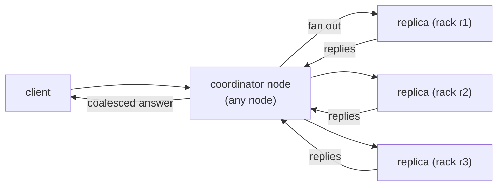
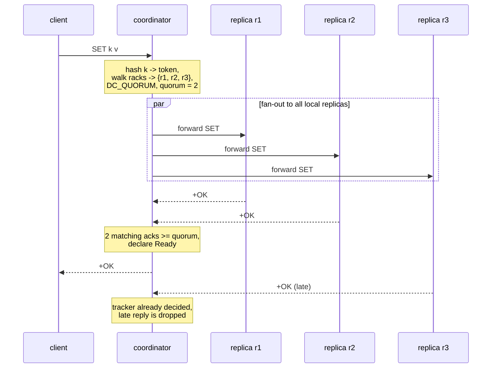
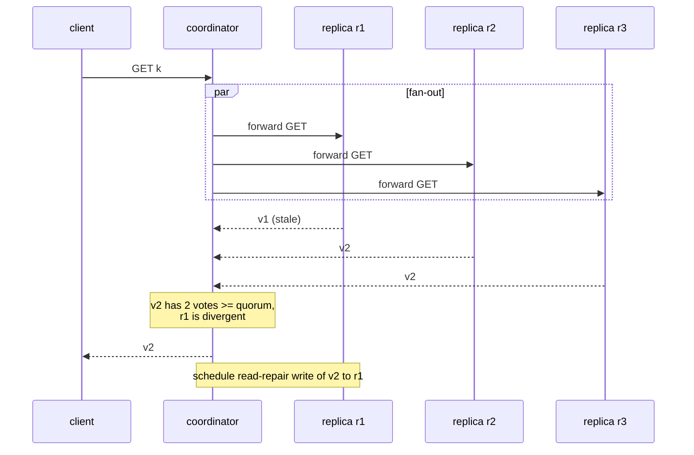
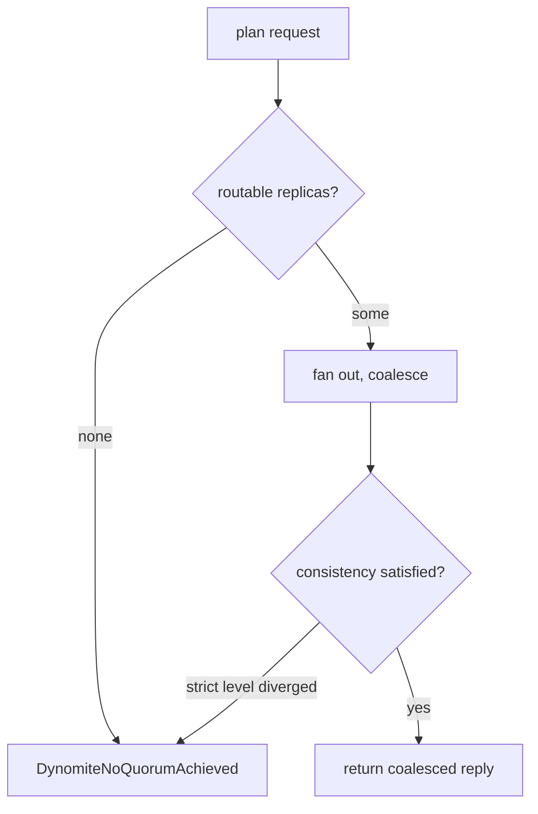
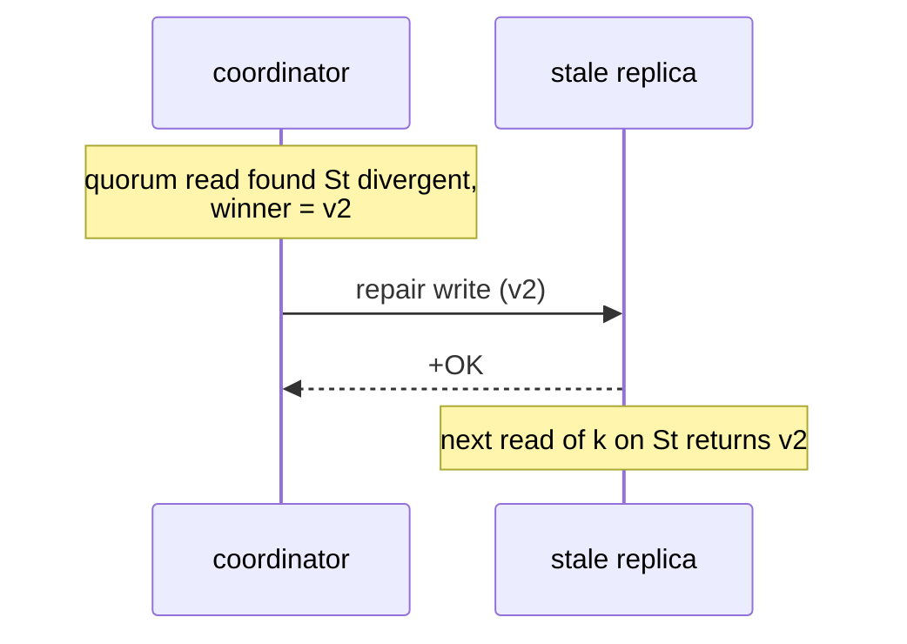

# Replication and Consistency

<div class="dyn-hero">
<span class="dyn-tagline">Availability first, consistency by the
knob-turn.</span>

Dynomite is a Dynamo-style, eventually-consistent system. It replicates
every write across racks and datacenters and lets you choose, per pool
and per bucket, how many replicas must answer before a request is
considered done. This is tunable quorum, not consensus: it buys you
availability under partition, and it hands you the reconciliation problem
in return.
</div>

This chapter defines the four consistency levels, spells out read and
write semantics for each, walks a quorum write and a quorum read as
sequence diagrams, explains what a no-quorum error means, and describes
read repair on divergence. It is explicit that none of this is
linearizable consensus, and it says why.

## The model: replicate wide, agree loosely

Every key has a replica set: one node per rack in each datacenter, as
described in [The Ring and the Token Space](./ring.md). A write is sent to
those replicas; a read gathers answers from them. The consistency level
decides how many answers count as "enough" and what to do when they
disagree.


<p class="dyn-caption">The node the client happens to connect to is the
coordinator for that request. It fans the request to the replica set,
coalesces the replies according to the consistency level, and returns one
answer.</p>

The coordinator is stateless with respect to the key -- any node can play
the role because any node can compute the replica set from the ring. There
is no primary replica, no leader, and no log. This is the Amazon Dynamo
lineage: available and partition-tolerant, with consistency as a tunable
rather than a guarantee.

```admonish warning title="This is not linearizable consensus"
Dynomite does not run RAFT, Paxos, or any leader-based log. There is no
single authority that orders writes. Two clients writing the same key
concurrently through different coordinators can both succeed, and a later
read can observe either value (or, under a strict level, an error). If you
need linearizable single-key semantics, Dynomite's quorum levels do not
provide them; see the note at the end of this chapter and
[Roads Not Taken](../reference/roads-not-taken.md).
```

## The four consistency levels

Consistency is expressed by the
[`ConsistencyLevel`](DYN_SRC_BASE/crates/dynomite/src/msg)
enum, resolved per request from the pool's `read_consistency` /
`write_consistency` (or a bucket-type override) in
[`cluster/dispatch.rs`](DYN_SRC_BASE/crates/dynomite/src/cluster/dispatch.rs).
The per-reply coalescing rules live in
[`proto/redis/coalesce.rs`](DYN_SRC_BASE/crates/dynomite/src/proto/redis/coalesce.rs).

<dl class="dyn-facts">
<dt>DC_ONE</dt>
<dd>One replica's answer suffices. Reads pick the rack-closest local
replica and return its first reply; writes fan to every local-DC replica
and ack on the first success. The default.</dd>
<dt>DC_QUORUM</dt>
<dd>A majority of local-DC replicas must agree. Quorum is
<code>floor(N/2)+1</code> over the local DC's replica count. Divergent
replicas are recorded for read repair.</dd>
<dt>DC_SAFE_QUORUM</dt>
<dd>Every received local-DC reply must agree. Waits for all local
replies; any divergence is a hard error, not a majority vote.</dd>
<dt>DC_EACH_SAFE_QUORUM</dt>
<dd>Per-DC unanimity. Every datacenter's replicas must internally agree;
the local DC's agreed answer is returned to the client, and any replica
in any DC that diverges from its DC's answer is marked for repair.</dd>
</dl>

The scope of "quorum" is always the **local datacenter's** replica set,
except for `DC_EACH_SAFE_QUORUM`, which imposes agreement in every DC. The
quorum count uses the local replica count, and racks are the replicas, so
`N` is the number of racks in the local DC.

### DC_ONE

The weakest and fastest level.

* **Read.** The coordinator picks the single rack-closest local-DC replica
  -- lowest [`RackDistance`](DYN_SRC_BASE/crates/dynomite/src/cluster/snitch.rs)
  cost, so same-rack beats same-DC beats remote -- and returns its first
  reply. No divergence is reported; read repair is a quorum-or-stronger
  feature.
* **Write.** The coordinator fans out to *every* local-DC replica for
  durability (each rack is a replica), and the coalescer acks the client on
  the first successful reply. The write still reaches all local replicas;
  the client just does not wait for all of them.

```admonish note title="DC_ONE writes are still replicated"
It is a common misread that DC_ONE means "write to one replica". The write
is *delivered* to every local-DC replica; only the *acknowledgement* is
returned on the first reply. This matches upstream Dynomite, where a
DC_ONE write replicates within the local DC.
```

### DC_QUORUM

The classic tunable-quorum level.

* Quorum is `local_count / 2 + 1`. With three racks that is two.
* The coordinator fans out to every local-DC replica, tallies votes keyed
  by reply payload, and declares the request done as soon as one payload
  gathers at least quorum votes. The most-voted payload is the winner;
  ties break toward the first-arrived majority.
* Replicas whose payload differs from the winner are reported as
  **divergent targets** and scheduled for read repair.
* If all local replies are in and no payload reached quorum, the coalescer
  picks the plurality winner (highest vote count, lowest peer index as
  tiebreak) and marks the rest divergent.

### DC_SAFE_QUORUM

Like `DC_QUORUM` but it does not settle for a majority: it waits for every
local-DC reply and requires them all to agree. If they do, the agreed reply
is returned. If any local reply diverges once all are in, the request is a
hard error rather than a majority decision. This trades availability for a
stronger read guarantee within the DC.

### DC_EACH_SAFE_QUORUM

The strictest level, spanning datacenters.

* Replicas are grouped by DC. Each DC must be internally unanimous once
  fully populated; an intra-DC divergence is an immediate error.
* The **local** DC's unanimous answer is the one returned to the client.
* Any replica -- in the local DC or a remote one -- whose payload differs
  from its DC's agreed answer is added to the divergent set for repair.
* Writes fan out per-DC (the plan walks the preselected rack in each remote
  DC in addition to the local-DC replicas).

## A quorum write, step by step


<p class="dyn-caption">A DC_QUORUM write with three replicas. The
coordinator returns as soon as two replicas agree; the third reply, even
though it arrives, does not produce a second answer -- the coalescer is
one-shot.</p>

The one-shot property matters: the per-request coalescer
([`CoalesceTracker`](DYN_SRC_BASE/crates/dynomite/src/proto/redis/coalesce.rs))
pins its decision the moment quorum is reached and reports every later
reply as pending, so a straggler can be drained (and inspected for repair)
without ever emitting a duplicate answer to the client.

## A quorum read with divergence


<p class="dyn-caption">A DC_QUORUM read where one replica is stale. The
majority value v2 is returned to the client, and the stale replica r1 is
scheduled for a read-repair write so the next read finds it consistent.</p>

Reply equivalence is by exact wire-byte comparison, with the error flag
folded into the key: a successful reply and an error reply never coalesce
even if their bytes match. This keeps an error on one replica from being
mistaken for agreement.

## No-quorum errors

When the topology cannot satisfy a request, the dispatcher returns a
`DynomiteNoQuorumAchieved` error rather than a stale or partial answer.
This happens when:

* the pool has no peers, or the key resolves to no routable replica
  (`DispatchPlan::NoTargets`);
* under a strict level, replies diverge and no agreement is possible
  (`DC_SAFE_QUORUM` divergence, `DC_EACH_SAFE_QUORUM` intra-DC
  divergence);
* every replica fan-out failed to send and no hint could be recorded.


<p class="dyn-caption">A no-quorum error is a deliberate refusal to
answer, not a crash. It tells the client that the requested consistency
level could not be met with the replicas currently reachable.</p>

A no-quorum error is a *safety* response: the system would rather refuse
than return an answer that violates the requested level. The failure-cause
metrics count each no-quorum branch so an operator can distinguish
"nobody home" from "replicas disagreed under a strict level".

## Read repair

Read repair is how divergence discovered during a quorum read gets healed
without a separate scan. When the coalescer reports divergent targets, the
dispatcher schedules a repair write of the winning value to each stale
replica through the same per-peer channels it used for the fan-out. The
repair plumbing lives in
[`proto/redis/repair/`](DYN_SRC_BASE/crates/dynomite/src/proto/redis/repair):

* `reconcile` picks a single response from the per-replica set and,
  where supported, produces the read-repair side effect;
* `make` builds the repair message when responses disagree;
* `rewrite` handles command-level rewrites (for example, turning
  `SMEMBERS` into a deterministic `SORT ALPHA` under `DC_SAFE_QUORUM` so
  set ordering does not read as divergence, and rewriting a write into a
  timestamped Lua script so a later reconcile can pick the newer value);
* `clear` emits metadata cleanup after a delete.


<p class="dyn-caption">Read repair is opportunistic: it heals exactly the
replicas that a real read touched and found stale. Replicas nobody reads
are healed by anti-entropy instead (see below).</p>

Read repair only heals what reads observe. Keys that are written but rarely
read, or replicas that were down during the read, are reconciled by the
background anti-entropy path -- the Merkle-tree repair described in
[Failure Handling](./failure.md) and, for the Dyniak layer, in
[Dyniak AAE](../dyniak/aae.md).

```admonish note title="Road not taken: consensus instead of quorum"
We considered a leader-based consensus layer (RAFT) for strong single-key
semantics. It was rejected for the engine's core path: consensus makes the
system unavailable for writes during a partition of the leader's side,
which is exactly the failure mode Dynomite exists to survive. The Dynamo
bet is that a highly-available, eventually-consistent layer plus tunable
quorum plus read repair and anti-entropy is the right trade for the
workloads Dynomite targets. Consensus-style guarantees, where needed, are
built above the engine in the Dyniak layer's transaction machinery, not in
the ring. See [Roads Not Taken](../reference/roads-not-taken.md).
```

## Choosing a level

<dl class="dyn-facts">
<dt>Latency-sensitive, tolerant of staleness</dt>
<dd>DC_ONE. One local reply, no waiting on the slow rack.</dd>
<dt>Balanced read-your-writes within a DC</dt>
<dd>DC_QUORUM read and write. A quorum write plus a quorum read overlaps
in at least one replica, so a quorum read after a quorum write observes
the write.</dd>
<dt>Strong intra-DC agreement, willing to error on divergence</dt>
<dd>DC_SAFE_QUORUM.</dd>
<dt>Cross-DC agreement</dt>
<dd>DC_EACH_SAFE_QUORUM, at the cost of waiting on every DC.</dd>
</dl>

Levels are set per pool and can be overridden per bucket type, so a single
deployment can serve a latency-sensitive cache at `DC_ONE` and a
correctness-sensitive dataset at `DC_QUORUM` from the same nodes. The knobs
are documented in [Configuration](../configuration.md).

## Where to go next

* [The Ring and the Token Space](./ring.md) -- how the replica set that
  quorum operates over is computed.
* [Membership and Gossip](./gossip.md) -- how the coordinator learns which
  replicas exist and are up.
* [Failure Handling](./failure.md) -- hinted handoff, and the
  anti-entropy path that heals what read repair does not.
* [DNODE protocol](../protocols/dnode.md) -- the frames the coordinator
  sends to replicas.
</content>
