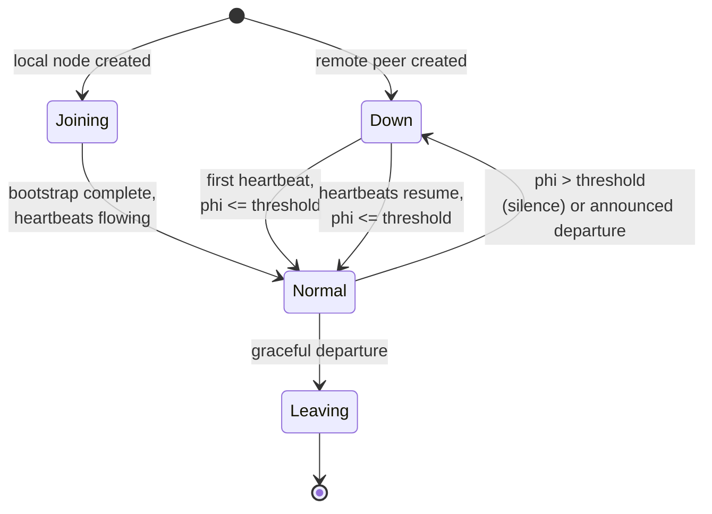
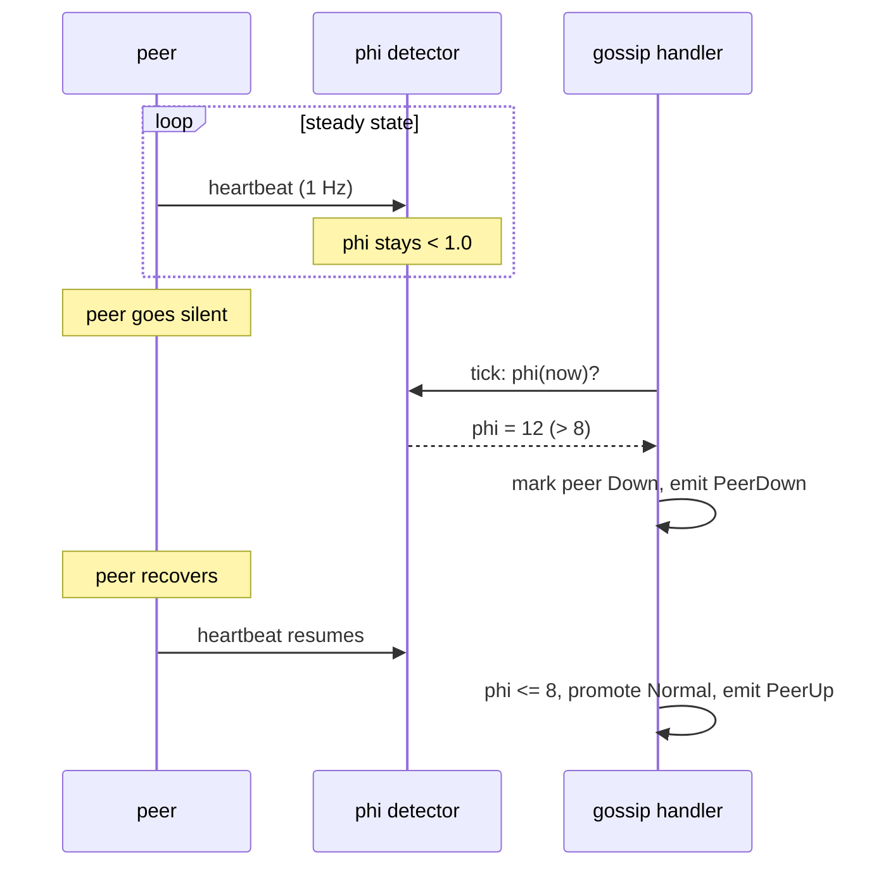
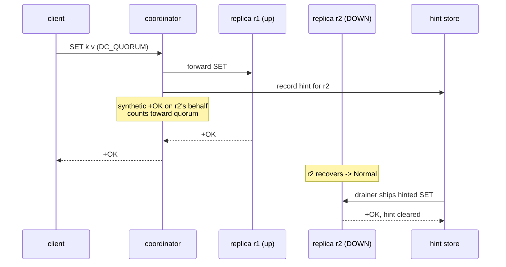
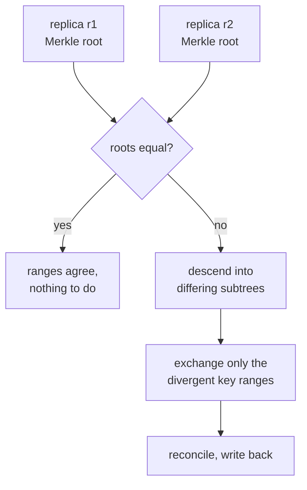
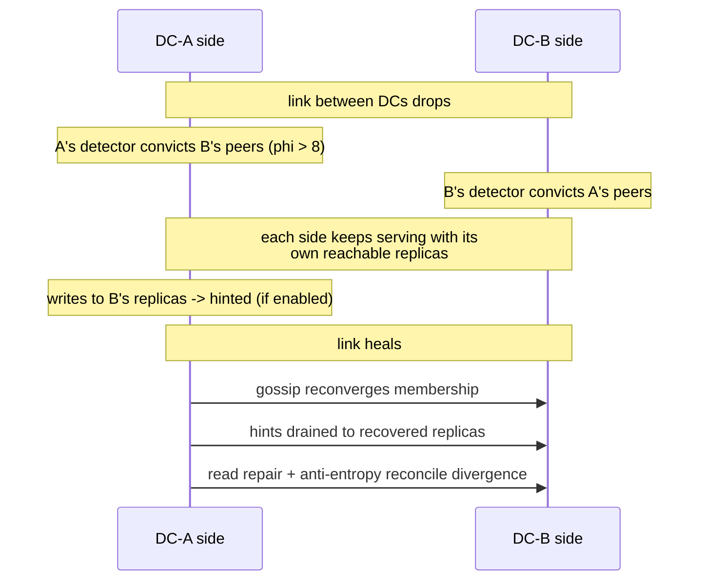

# Failure Handling

<div class="dyn-hero">
<span class="dyn-tagline">Nodes fail, links partition, clocks drift.
Dynomite is built to stay available through all of it and to heal the
damage afterward.</span>

Failure handling in Dynomite is layered: an adaptive detector decides
when a peer is dead, gossip ejects and readmits it, hinted handoff keeps
writes durable while it is gone, and read repair plus Merkle-tree
anti-entropy reconcile the divergence that a failure leaves behind.
</div>

This chapter walks the phi-accrual failure detector and the peer state
machine, auto-eject and auto-rejoin, durable hinted handoff, read repair,
the anti-entropy overview, and the guarantees that hold across a
partition.

## Detecting failure: phi-accrual

A naive detector flips a peer between "alive" and "dead" on a
missed-heartbeat count. That is brittle: a network hiccup trips it, and a
genuinely slow link never does. Dynomite uses a **phi-accrual** detector
([`PhiAccrual`](https://codeberg.org/gregburd/dynomite/src/branch/main/crates/dynomite/src/cluster/failure_detector.rs)),
the same family Cassandra, Akka, and Riak deploy, which produces a
continuous suspicion level `phi(t)` instead of a boolean.

Phi is the negative log-probability that a heartbeat *would not have
arrived yet* given the historical inter-arrival distribution. Modelling
arrivals as exponential gives the closed form the detector computes:

```text
    phi(t) = elapsed_ms / (mean_interval_ms * ln(10))
```

<dl class="dyn-facts">
<dt>phi = 1.0</dt>
<dd>~10% chance the heartbeat is merely late.</dd>
<dt>phi = 2.0</dt>
<dd>~1% chance.</dd>
<dt>phi = 8.0</dt>
<dd>~10^-8 -- "almost certainly dead". This is the default threshold
(<code>DEFAULT_THRESHOLD</code>), matching Cassandra's
<code>phi_convict_threshold</code>.</dd>
</dl>

The detector keeps a sliding window of the last ~100 inter-arrival times
per peer, so it adapts to each link's real cadence. A jittery link that
normally varies wildly will not be convicted by a one-second gap that
would convict a metronome-steady link -- higher observed variance widens
the tolerated gap. Two guards keep the math honest: the mean interval is
clamped at a floor (default 1s) so burst arrivals cannot make phi spike,
and phi is `0.0` when no heartbeat has ever been recorded (no data is not
the same as dead) or when fewer than two heartbeats give no inter-arrival
sample.

```admonish note title="Scope: peer plane only"
The phi-accrual detector is for the dnode peer plane, driven by gossip
heartbeats. The backend datastore (redis / memcache) is not
heartbeat-driven -- it is exercised by real client traffic -- so backend
health uses a consecutive-failure auto-eject tracker instead. Do not wire
phi-accrual into backend supervision.
```

## The peer state machine

Each peer carries a
[`PeerState`](https://codeberg.org/gregburd/dynomite/src/branch/main/crates/dynomite/src/cluster/peer.rs).
Only `Normal` and `Joining` are routable; `Down` and `Leaving` are not.
A remote peer starts `Down` and is promoted only after its first
below-threshold heartbeat; the local node starts `Joining`.


<p class="dyn-caption">Peer lifecycle. The routable states are Normal and
Joining; the failure detector drives the Normal/Down toggle, and a
graceful departure moves a peer to Leaving so it stops receiving traffic
before it goes.</p>

The gossip handler is the single owner of these transitions once gossip is
wired. On each inbound heartbeat it records the arrival and, if phi is
below threshold, promotes the peer to `Normal` at once. On each periodic
tick it evaluates every non-local peer and toggles `Normal` / `Down` from
the current phi. A peer that flaps -- goes silent, is convicted, then
resumes -- produces exactly one `Normal -> Down` and one `Down -> Normal`
transition per cycle, each surfaced as a metric and a structured event.


<p class="dyn-caption">Silence raises phi past the threshold on the next
tick and convicts the peer; a resumed heartbeat promotes it back. The
detector's window means recovery is judged on the same adaptive baseline
as conviction.</p>

## Auto-eject and auto-rejoin

Eviction and readmission are gossip-driven, not operator-driven.

* **Auto-eject.** When a peer crosses the phi threshold (or announces its
  own departure), the handler marks it `Down`. The next continuum rebuild
  drops it from the routable set, and the dispatcher stops planning
  requests to it. No manual intervention, no config edit.
* **Auto-rejoin.** When a `Down` peer starts gossiping again and its phi
  falls below threshold, the handler promotes it back to `Normal` on the
  next heartbeat, and it re-enters the routable set on the next rebuild.
  Its failure detector is reset on re-add so old jitter does not bias the
  fresh baseline.

The whole loop is closed by gossip and the detector; the operator's role
is to fix the underlying fault, not to click a node back in.

## Hinted handoff

A write whose target replica is `Down` would normally just miss that
replica. Hinted handoff makes the write durable anyway: the coordinator
records a **hint** -- the on-the-wire request bytes, the intended peer
index, and an expiry deadline -- and a background drainer ships it to the
peer once the peer returns to `Normal`.


<p class="dyn-caption">Hinted handoff keeps a write durable across a
replica outage. The hint counts toward the consistency threshold at write
time and is replayed to the replica when it returns, so the down replica
catches up without a full repair.</p>

Handoff is only active when the hint store is wired *and* the pool sets
`enable_hinted_handoff`. When active, `Down` write targets are kept in the
routable set so the dispatcher can hint them; a synthetic `+OK` is fed to
the coalescer on the hinted target's behalf so the surviving replicas plus
the hint can meet the consistency threshold. Without handoff, a `Down`
target is simply skipped.

### Durability of hints

The hint store
([`HintStore`](https://codeberg.org/gregburd/dynomite/src/branch/main/crates/dynomite/src/cluster/hints.rs))
has two modes:

<dl class="dyn-facts">
<dt>RAM-only (<code>HintStore::new</code>)</dt>
<dd>Hints live only in per-peer in-memory queues and are lost if the
coordinator restarts.</dd>
<dt>Durable (<code>HintStore::open</code>, with <code>hint_dir</code>)</dt>
<dd>One append-only segment file per peer under
<code>&lt;dir&gt;/peer-&lt;idx&gt;.hints</code>. Each record is framed with
a length, an IEEE CRC-32 of the body, a wall-clock deadline, and the
payload. Hints survive a coordinator restart -- replay re-anchors each
deadline to the current clock and drops any already-expired hint.</dd>
</dl>

The durable format is torn-tail safe: a crash mid-append leaves at most a
trailing partial record, and replay detects it two ways -- a short read
before the body completes, or a body whose CRC does not match -- and stops
cleanly at the first damaged record, keeping every intact record before
it. A torn tail never panics and never surfaces an error from `open`.

Hints are bounded by `max_bytes` and expire after `hint_ttl_seconds`
(default one day). Over-capacity or zero-TTL enqueues are rejected so the
store cannot grow without bound; when the store is full the coordinator
falls back to its no-quorum error path rather than silently dropping the
write.

## Read repair

Read repair heals divergence that a quorum read observes: the majority
value is returned to the client and the stale replicas are written back
through the same channels. It is covered in full in
[Replication and Consistency](./consistency.md); the important boundary is
that read repair only heals replicas a real read touched. Keys that are
written but rarely read, and replicas that were down during the read, are
left for anti-entropy.

## Anti-entropy: Merkle-tree repair

Anti-entropy is the background reconciliation that does not depend on a
client reading a key. Replicas periodically compare compact **Merkle-tree**
digests of their key ranges; where the trees differ, only the divergent
sub-ranges are exchanged and reconciled, so a full replica comparison
costs a tree walk rather than a full data transfer.


<p class="dyn-caption">Merkle-tree anti-entropy narrows a whole-range
comparison to just the sub-ranges that actually differ. Equal roots mean
the replicas agree and no data moves.</p>

This is the safety net beneath read repair and hinted handoff: it catches
divergence that neither of the other two mechanisms reached -- writes that
were never read back, hints that expired before the peer recovered, or
data that drifted during a long partition. The full anti-entropy design,
including the transactional Dyniak layer's reconciliation, is documented in
[Dyniak AAE](../dyniak/aae.md).

## What happens during a partition

Put the three mechanisms together and the partition story is:


<p class="dyn-caption">A cross-DC partition. Each side stays available on
its own replicas, records hints for the unreachable side, and reconciles
via gossip, hint drain, read repair, and anti-entropy once the link
heals.</p>

<dl class="dyn-facts">
<dt>Availability</dt>
<dd>Both sides of a partition keep serving reads and writes against the
replicas they can still reach. There is no leader to lose, so neither
side stalls.</dd>
<dt>Durability within quorum</dt>
<dd>A write that meets its consistency level on the reachable side is not
lost: it is on that side's replicas, and -- if hinted handoff is enabled
-- queued for the unreachable replicas. When the partition heals, gossip
readmits the peers, hints drain, and anti-entropy plus read repair close
any remaining gap.</dd>
<dt>Consistency</dt>
<dd>Divergent writes on the two sides are reconciled after the heal, not
prevented during the split. Under the strict consistency levels a request
that cannot meet its level returns a no-quorum error rather than a
divergent answer (see <a href="./consistency.md">Replication and
Consistency</a>).</dd>
</dl>

```admonish warning title="The guarantee is quorum-scoped"
"No data loss" holds for writes that met their consistency level on a
side that survived. A write acknowledged at DC_ONE that landed only on a
replica which then failed permanently before hinting or anti-entropy
could copy it elsewhere is a genuine loss -- that is the trade DC_ONE
buys you. Choose the level that matches your durability requirement; see
[Replication and Consistency](./consistency.md).
```

```admonish note title="Road not taken: fencing / leader-based failover"
Dynomite does not fence a partitioned node or fail writes over to a
leader, because there is no leader and no fencing token. The Dynamo model
accepts concurrent writes on both sides of a partition and reconciles
after the fact; that is what keeps both sides available. Systems that
need strict single-writer semantics use a consensus layer instead and pay
the availability cost during partition. See
[Roads Not Taken](../reference/roads-not-taken.md).
```

## Where to go next

* [Membership and Gossip](./gossip.md) -- how the failure detector is fed
  and how ejection / readmission propagate.
* [Replication and Consistency](./consistency.md) -- read repair, the
  consistency levels, and what a no-quorum error means.
* [The Ring and the Token Space](./ring.md) -- how a `Down` peer drops out
  of routing on the next continuum rebuild.
* [Dyniak AAE](../dyniak/aae.md) -- the full Merkle-tree anti-entropy and
  the transactional reconciliation path.
* [Configuration](../configuration.md) -- the `enable_hinted_handoff`,
  `hint_dir`, `hint_ttl_seconds`, and failure-detector knobs.
</content>
