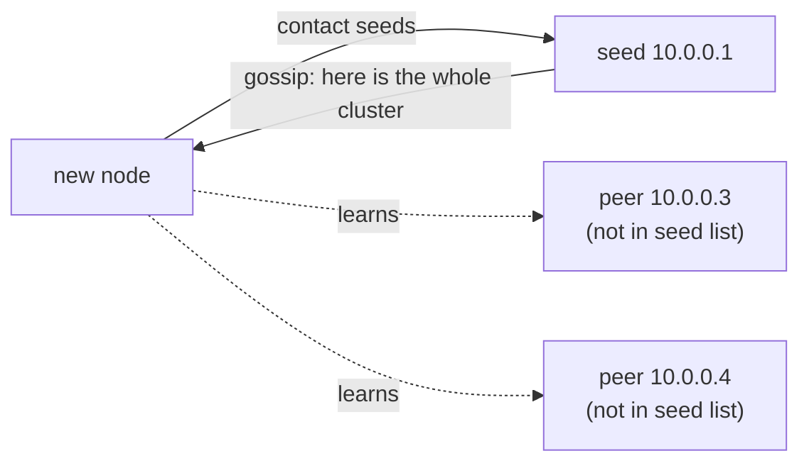
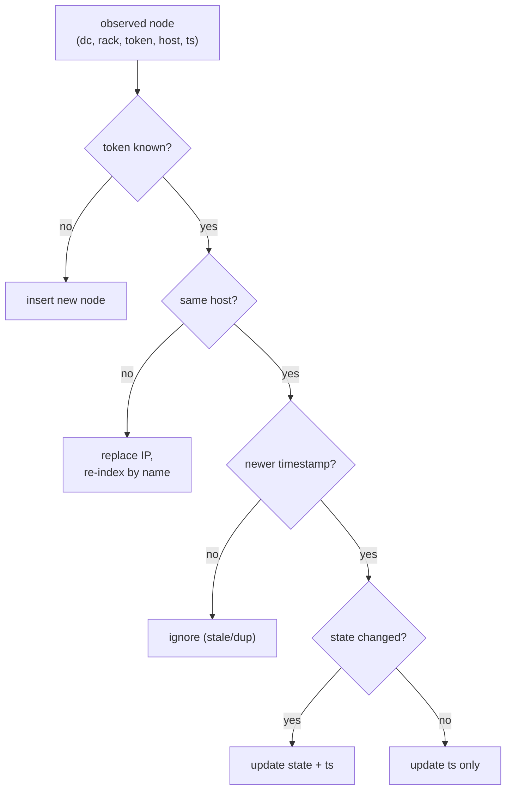
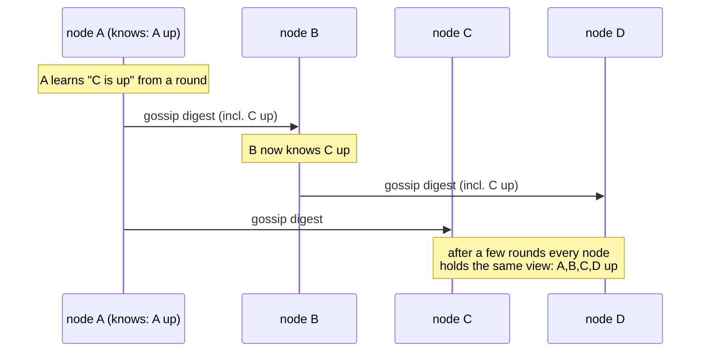
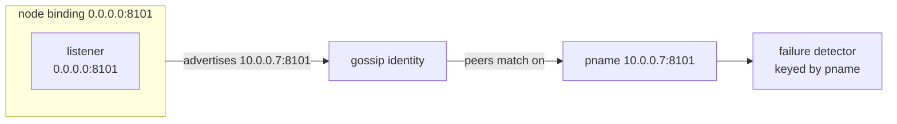
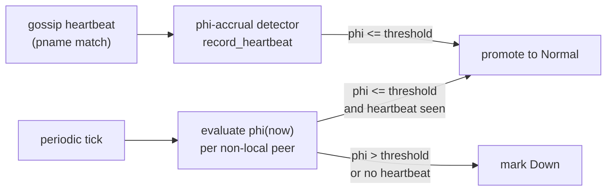

# Membership and Gossip

<div class="dyn-hero">
<span class="dyn-tagline">Nobody is in charge of the member list, and
that is the point.</span>

Dynomite discovers and tracks cluster membership by gossip: each node
periodically exchanges state with a peer, and over a few rounds every
node converges on the same view of who exists, where they sit on the
ring, and whether they are alive. There is no membership coordinator to
lose.
</div>

This chapter covers how nodes find each other through seeds, how gossip
propagates state and converges, the shape of a peer's identity and why an
advertised address matters, and how the gossip plane feeds the failure
detector described in [Failure Handling](./failure.md).

## Why gossip and not a coordinator

A central membership service is simpler to reason about -- one authority,
one answer -- but it is also a single point of failure and a single point
of partition. If the coordinator is unreachable, either the cluster stops
accepting membership changes or it forks into disagreeing halves.

```admonish note title="Road not taken: a central membership coordinator"
We deliberately did not put a coordinator, a consensus group, or an
external registry (ZooKeeper / etcd) on the membership path. Gossip has no
node whose loss stalls the cluster, degrades gracefully under partition
(each side keeps its own converged view and reconciles when the link
heals), and scales without a hot central service. The cost is that
membership is eventually consistent -- a just-joined node is not instantly
visible everywhere -- which is exactly the consistency posture the rest of
Dynomite already assumes. See
[Roads Not Taken](../reference/roads-not-taken.md).
```

## Seeds: the bootstrap list

A brand-new node knows nothing about the cluster except its **seeds**: a
list of `host:port:rack:dc:tokens` entries supplied through the seeds
provider (the static `dyn_seeds` list, or a dynamic provider). Parsing is
done by
[`parse_seed_node` / `parse_seed_blob`](DYN_SRC_BASE/crates/dynomite/src/cluster/gossip.rs):
entries are separated by `|`, and each entry's fields are split from the
right so a host containing colons parses correctly. The token field may be
a single big-integer or a comma-separated list (for a vnode node).

```text
10.0.0.1:8101:rackA:dc1:1383429731|10.0.0.2:8101:rackB:dc1:2147483648
```

Seeds are a bootstrap hint, not the authority. A node contacts its seeds to
enter the gossip mesh, but once it has gossiped it knows about peers that
were never in its seed list, and it keeps functioning if a seed is down --
as long as *some* reachable seed lets it join the mesh. The seeds provider
is re-queried at most once per `seeds_check_interval` (30s by default), so
a changing seed list is picked up without restarting the node.


<p class="dyn-caption">Seeds get a node into the mesh; gossip does the
rest. After the first round the new node knows peers that were never in
its seed list.</p>

## The gossip round

Gossip runs on a fixed interval (`gos_interval`, 1000 ms by default). Each
round the node:

1. Queries the seeds provider if the seeds-check interval has elapsed, and
   reconciles the returned entries against its peer and gossip tables.
2. Applies its per-node add-or-update state machine to each observed node.
3. Forwards state to one randomly chosen peer: a `GOSSIP_SYN` if the local
   node is still joining, or its local state digest if it is normal.

The reconciliation is the interesting part. It is driven by
`GossipState::add_or_update`, keyed on `(dc, rack, primary-token)` and on
`(dc, rack, host)`:


<p class="dyn-caption">The add-or-update state machine. A node is inserted
when new, has its IP replaced when the token is known but the host moved,
and is timestamp- or state-updated when only the clock or the lifecycle
moved forward. Stale updates are dropped by the timestamp check.</p>

Two properties fall out of this design:

<dl class="dyn-facts">
<dt>Token is identity</dt>
<dd>A node is identified on the ring by its <code>(dc, rack, primary
token)</code>. If the same token reappears under a new host, that is an
IP change for the same logical node, not a new node -- the old name index
is dropped and re-created.</dd>
<dt>Timestamps break ties</dt>
<dd>Every update carries an epoch-seconds timestamp. An update with a
timestamp no newer than what is stored is ignored, so out-of-order or
duplicate gossip cannot roll state backward.</dd>
</dl>

## Convergence

Because each round pushes state to one random peer, information spreads
epidemically: a fact known to one node reaches roughly all connected nodes
in `O(log N)` rounds. There is no barrier, no acknowledgement of global
receipt, and no notion of "the membership is now final" -- the cluster is
always converging toward the latest observed state, and under a stable
topology it reaches a fixed point where every node's view agrees.


<p class="dyn-caption">Epidemic propagation. Each node forwards to one
random peer per round; a new fact reaches the whole connected cluster in a
logarithmic number of rounds. Convergence is eventual, not instantaneous.</p>

When the topology stops changing, gossip converges and the per-rack
continua rebuilt from that converged view are byte-identical across nodes
-- which is precisely the determinism that makes ring routing
coordination-free (see [The Ring and the Token Space](./ring.md)).

## Peer identity and the advertised address

A peer is matched by its endpoint's `pname` -- the `host:port` string. The
gossip handler records inbound heartbeats against the peer whose
`PeerEndpoint::pname()` matches the sender, and the failure detector is
keyed the same way. This makes the *advertised* address load-bearing.

```admonish warning title="Bind wildcard, advertise routable"
A node that binds its peer listener to a wildcard address such as
<code>0.0.0.0</code> (or <code>::</code>) must still advertise a concrete,
routable address in its seed entry and gossip identity. Peers match
gossip by <code>host:port</code>; if a node advertises <code>0.0.0.0</code>
its peers cannot associate its heartbeats with a ring position, the
failure detector never sees heartbeats for it, and it is treated as
permanently down. Bind wide, advertise narrow.
```

The reason is mechanical: gossip carries a node's own claimed address, and
every other node stores and matches on that address. A wildcard is not an
address any peer can send to or reconcile against. The advertised address
must be the one peers actually reach the node on.


<p class="dyn-caption">Bind address and advertised address are different
things. The listener may be wildcard; the gossip identity must be a
routable host:port, because that is the key every peer matches on.</p>

## From gossip to peer state

Once gossip is wired, the gossip handler
([`GossipHandler`](DYN_SRC_BASE/crates/dynomite/src/cluster/gossip.rs))
is the single owner of peer-state transitions. It does two things with
each inbound heartbeat and each periodic tick:

* **On heartbeat.** It feeds the peer's phi-accrual failure detector and,
  if the peer's suspicion level is below threshold and it is not already
  `Normal`, promotes it to `Normal` immediately. This gives a
  just-contacted peer a snappy first-contact transition instead of waiting
  a full tick.
* **On tick.** It re-evaluates every non-local peer's suspicion level and
  toggles between `Normal` and `Down`: a peer is `Normal` once at least one
  heartbeat has been recorded and its phi is at or below threshold, and
  `Down` when no heartbeat has ever arrived or its phi exceeds threshold.


<p class="dyn-caption">Gossip feeds the failure detector; the failure
detector decides liveness. Membership (who exists, where on the ring) and
liveness (who is up) are separate concerns tracked by the same handler.</p>

There is a second, coarser detector on the raw gossip table
(`GossipState::run_failure_detector`) that ages a node to `Down` when its
last-seen timestamp is older than `40 * gos_interval`. The phi-accrual
detector is the primary, adaptive mechanism; the timestamp aging is a
backstop for nodes that stopped gossiping entirely. Both feed the same
`PeerState`, and the mechanics of that state machine are the subject of
[Failure Handling](./failure.md).

## Shutdown and departure

A node leaving the cluster announces its own departure through gossip. The
handler's `mark_down_pname` marks the departing peer `Down` without
consulting the failure detector, so the dispatcher stops routing to it
immediately rather than waiting for phi to accrue. When a peer is removed
and later re-added, its failure detector is reset so historical jitter does
not bias the fresh suspicion value.

## Where to go next

* [Failure Handling](./failure.md) -- the phi-accrual detector, the peer
  state machine, auto-eject / auto-rejoin, and what happens during a
  partition.
* [The Ring and the Token Space](./ring.md) -- how the converged
  membership view becomes the routing ring.
* [DNODE protocol](../protocols/dnode.md) -- the wire format carrying
  `GOSSIP_SYN` and the state digests between peers.
* [Configuration](../configuration.md) -- the `dyn_seeds`,
  `gos_interval`, and gossip enable knobs.
</content>
