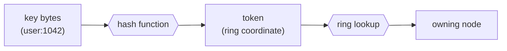
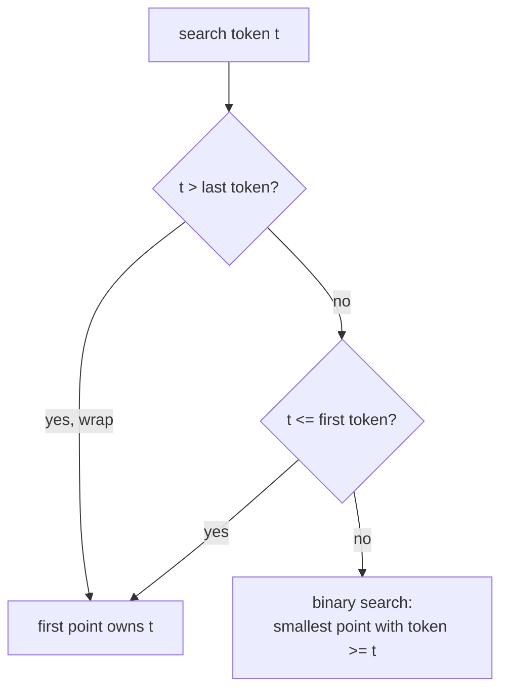
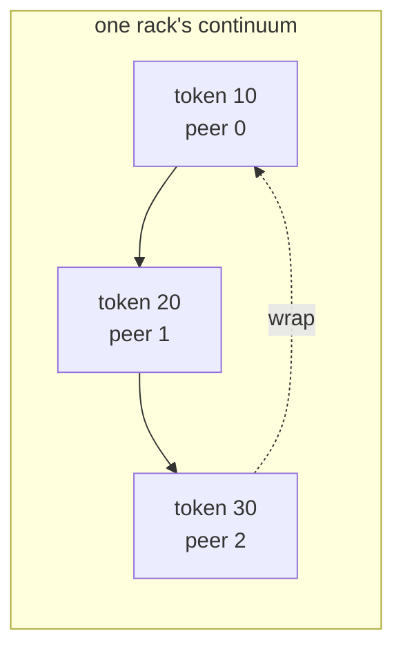
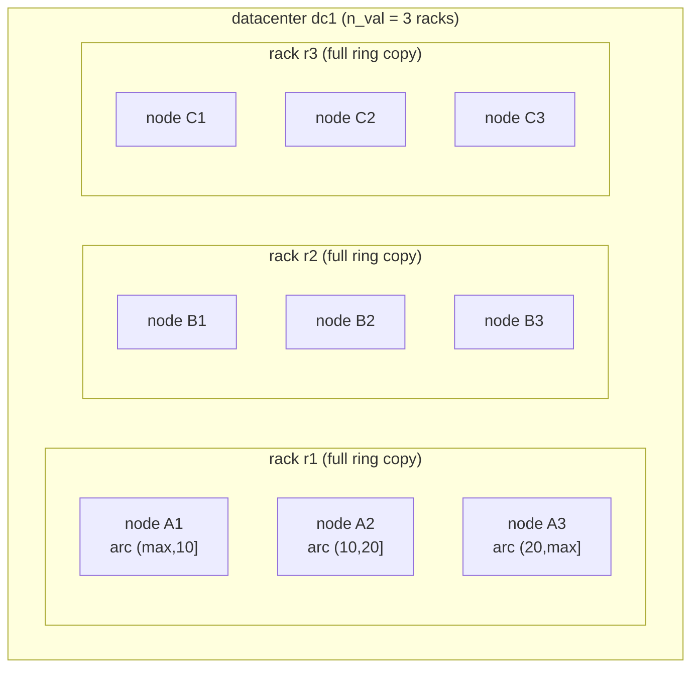
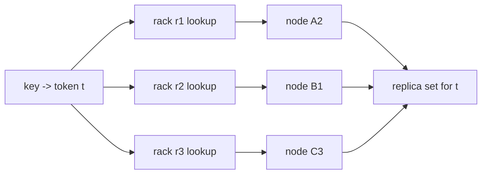
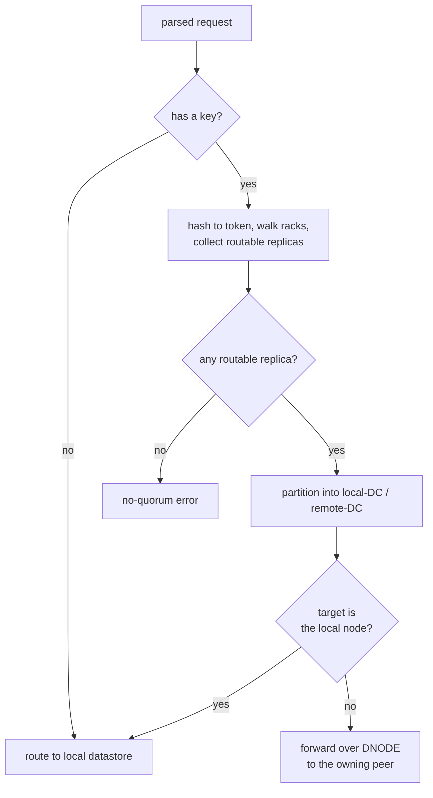

# The Ring and the Token Space

<div class="dyn-hero">
<span class="dyn-tagline">Every key has an owner, and every node can
name that owner without asking anyone.</span>

The token ring is the map that turns an opaque byte key into a
definite home. It is computed identically on every node from the same
gossiped topology, so any node can route any request without a central
directory and without a network round-trip to "look up" where a key
lives.
</div>

This chapter covers how a key becomes a token, how a token maps to an
owning node, how tokens are assigned to nodes, and how the rack-as-replica
model layers full copies of the ring across fault domains. It closes with
how the [`ClusterDispatcher`](../configuration.md) decides between serving a
request locally and forwarding it over the
[DNODE protocol](../protocols/dnode.md).

## Keys, hashes, and tokens

A client request carries a key -- the bytes between the command verb and
its value. Dynomite feeds those bytes through the pool's configured hash
function and interprets the result as a **token**: a coordinate on a
one-dimensional ring.


<p class="dyn-caption">A key is hashed to a token; the token is looked
up on the ring; the lookup names the owning node. Each arrow is a pure
function -- no I/O, no coordination.</p>

The hash function is selected per pool from the configured
[`hash`](../configuration.md) knob. The runtime enum
[`HashType`](DYN_SRC_BASE/crates/dynomite/src/hashkit)
covers the full upstream set (Murmur, Murmur3, the FNV family, CRC16/32,
Jenkins, MD5, and the default one-at-a-time). The configuration-layer enum
is mapped onto the runtime enum by `map_hash` in
[`cluster/dispatch.rs`](DYN_SRC_BASE/crates/dynomite/src/cluster/dispatch.rs);
that mapping is the single seam so the dispatcher, the reaper, and the
Dyniak replica router all agree on which hash a pool uses.

```admonish note title="Hash tags"
The token is computed over the *hash tag*, not necessarily the whole
key. When a key contains a `{...}` tag, only the bytes inside the braces
are hashed, so `{user:1042}:profile` and `{user:1042}:sessions` land on
the same node. The dispatcher pulls the tag-aware sub-range via
`KeyPos::tag_bytes`; commands with no parsed key (`PING`, `INFO`) route
to the local datastore.
```

### The token as a signed big integer

Tokens are not `u64`s. They are stored as a signed-magnitude big integer,
[`DynToken`](DYN_SRC_BASE/crates/dynomite/src/hashkit/token.rs),
holding up to four little-significance-first 32-bit words plus a sign
(`Negative`, `Zero`, `Positive`). This representation exists for one
reason: to compare and parse tokens *bit-identically* across peers.

<dl class="dyn-facts">
<dt>Comparison</dt>
<dd>Sign first, then word length, then word-by-word from the most
significant word. A negative token always sorts below a positive one.</dd>
<dt>Textual parsing</dt>
<dd>An optional leading <code>-</code>, then base-10 digit groups folded
by a fixed radix constant. The constant is deliberately the on-the-wire
value peers expect, not a clean power of ten, so a Rust node and a peer
agree on every token string.</dd>
<dt>Hashing into the token</dt>
<dd>The hash output is loaded into the token's magnitude words; a
32-bit hash occupies one word.</dd>
</dl>

```admonish warning title="Do not treat the token comparator as arithmetic"
The comparator is a total order over the representation, not an integer
comparator with wraparound. The ring's wraparound behaviour lives in the
dispatch function, not in `DynToken::cmp`. See the wraparound rule below.
```

## Mapping a token to a node: the continuum

Each rack stores its slice of the ring as a **continuum**: a vector of
`(token, peer_idx)` points sorted ascending by token. Building the
continuum is a rebuild pass over the pool's peer list;
[`rebuild_continuums`](DYN_SRC_BASE/crates/dynomite/src/cluster/vnode.rs)
clears every rack's continuum, appends each peer's tokens onto the owning
rack, then sorts each touched rack once.

Lookup is a left-leaning binary search in `vnode::dispatch`. Given a
search token `t`:

* if `t` is greater than the largest continuum token, **wrap** to the
  first point;
* if `t` is less than or equal to the first continuum token, also return
  the first point;
* otherwise, return the smallest continuum entry whose token is
  greater than or equal to `t` (upper-bound, `(a, b]` semantics).


<p class="dyn-caption">The dispatch function reproduces the reference
ring semantics exactly: a key past the end of the ring wraps to the
first owner, and every other key is owned by the next point clockwise.</p>

The ring is conceptually circular, but the storage is a sorted array; the
wraparound branch is what makes the last segment of the array and the
first point share responsibility for the arc that crosses the ring's
zero point.


<p class="dyn-caption">Three peers, three tokens. A key hashing to 15 is
owned by peer 1 (upper bound of 20); a key hashing to 35 wraps to peer 0.
This is exactly the behaviour pinned by the <code>dispatch</code>
doctests.</p>

## Token assignment and vnodes

Each peer carries a token list. In the simplest deployment a peer owns a
single token -- its position on the ring -- and the nodes in a rack
partition the ring into as many arcs as there are nodes. A node's token
is the *end* of the arc it owns (upper-bound semantics), so the node with
token 20 owns the half-open arc `(10, 20]` when its neighbour holds 10.

A peer may hold more than one token. Each additional token is an
independent continuum point pointing back at the same peer index, so a
single physical node can occupy several positions on the ring. This is the
vnode (virtual node) idea: more, smaller arcs per node smooth out the load
imbalance that a handful of large arcs would produce, and they make
rebalancing on membership change move less data per moved token.

<dl class="dyn-facts">
<dt>One token per node</dt>
<dd>Simple, and the classic single-token-per-node deployment. Arc
boundaries are the configured tokens; the seed list carries them.</dd>
<dt>Many tokens per node (vnodes)</dt>
<dd>Each token is a separate continuum point for the same peer index.
Smoother load, cheaper rebalancing, larger continuum.</dd>
</dl>

```admonish note title="Road not taken: rendezvous hashing everywhere"
Dynomite routes with a token ring (consistent hashing), not rendezvous
(highest-random-weight) hashing. Rendezvous hashing needs no sorted ring
and rebalances cleanly, but it costs an O(nodes) score computation per
key rather than an O(log points) binary search, and -- more importantly --
it does not reproduce the upstream Dynomite key-to-node mapping, which is
the whole point of a parity port. Random slicing is available as an
alternative partition table per rack (and as a shadow distribution to
diff routes against the live one), but the token ring is the default and
the reference. See [Roads Not Taken](../reference/roads-not-taken.md).
```

## Racks are replicas

Replication topology in Dynomite is expressed through the datacenter and
rack hierarchy, not through a separate replica-count parameter attached to
each key.

* A **datacenter** owns one or more **racks**.
* Within a datacenter, **each rack holds a full copy of the ring**. The
  number of racks in a DC is the replication factor (`n_val`) for that DC.
* Within a rack, **nodes partition the token space**. No two nodes in the
  same rack own the same arc; together they cover the whole ring exactly
  once.

Put differently: to place a key with a replication factor of three inside
one datacenter, you run three racks, and the key lands on one node in each
rack -- the node whose arc contains the key's token.


<p class="dyn-caption">One datacenter, three racks, three nodes per rack.
The ring is copied across racks (replication) and partitioned across
nodes within a rack (sharding). A key's replica set is one node from each
rack: the node whose arc owns the key's token.</p>

Each rack's continuum is built and searched independently. When the
dispatcher plans a request it walks every rack in every datacenter, runs
the ring lookup once per rack, and the union of the per-rack owners is the
key's replica set. Because each rack is a full copy, the per-rack lookup
always finds exactly one owner (or none, when the rack is empty).


<p class="dyn-caption">The same token is resolved once per rack. The
three owners -- one per rack -- form the replica set. This is the input
to the quorum machinery described in
<a href="./consistency.md">Replication and Consistency</a>.</p>

### Cross-datacenter placement

Multiple datacenters each hold their own set of racks, so a key is
replicated in every datacenter that has racks. When a write must be
replicated into a *remote* DC, Dynomite does not fan out to every rack in
that DC; it preselects one rack per remote DC to receive the cross-DC
copy. The preselection
([`ServerPool::preselect_remote_racks`](DYN_SRC_BASE/crates/dynomite/src/cluster/pool.rs))
sorts each DC's racks by name and, for each remote DC, chooses the rack at
`local_rack_index % remote_rack_count`. This spreads cross-DC replication
traffic evenly across the remote racks instead of hammering one.

## Routing: local versus remote

Once the dispatcher has the replica set, it splits it into local-DC and
remote-DC targets and decides, per consistency level, which of them the
request must actually reach. The full decision table is in
[Replication and Consistency](./consistency.md); here is the routing
mechanic that sits underneath it.


<p class="dyn-caption">A request either terminates at the local
datastore or is framed and forwarded to the owning peer over the DNODE
peer plane. The client never learns which; it always speaks to one node
and gets one answer.</p>

A peer is a routing candidate only when its
[`PeerState`](DYN_SRC_BASE/crates/dynomite/src/cluster/peer.rs)
is routable -- `Normal` or `Joining`. A `Joining` peer stays in the
continuum until it transitions to `Down` or `Leaving`, so it keeps
receiving traffic while it bootstraps. A `Down` peer is filtered out of
the routable set for reads and for writes when hinted handoff is off; when
hinted handoff is on, `Down` write targets are kept in the set so the
dispatcher can record a hint (see [Failure Handling](./failure.md)).

When the owning peer *is* the local node, the request short-circuits to
the local datastore rather than making a network hop to itself. This is
the `DispatchPlan::LocalDatastore` branch, and it is also the plan for
keyless commands and for requests explicitly tagged local-node-only.

Forwarding to a remote peer is a DNODE frame: the request bytes are
relayed verbatim to the peer's `dyn_listen` socket, the peer serves them
against its local backend, and the reply comes back through the
per-request responder channel. A request forwarded to a remote peer is
tagged as a *forward* so the receiver hands it straight to its datastore
instead of re-hashing and re-planning it -- which would, in the worst
case, bounce the request back. See the
[DNODE protocol](../protocols/dnode.md) chapter for the frame layout.

## Rebalancing on membership change

The ring is a pure function of the topology, and the topology changes only
through gossip. When a peer joins, leaves, or is marked down, gossip
updates the peer table and the continuum is rebuilt from scratch by
`rebuild_continuums`. Because the rebuild clears and repopulates every
touched rack deterministically, two nodes that have converged on the same
gossip view compute byte-identical continua and therefore route every key
identically.

```admonish tip title="Determinism is the invariant"
The property that makes routing coordination-free is not "the ring is
fast" but "the ring is a deterministic function of the gossiped
topology". Same topology plus same key implies same owner, on every node,
with no messages exchanged at routing time. That determinism is exercised
directly by the ring-routing property tests.
```

## Where to go next

* [Replication and Consistency](./consistency.md) -- how the replica set
  this chapter produces is turned into a client-visible answer under each
  tunable consistency level.
* [Membership and Gossip](./gossip.md) -- how the topology that feeds the
  ring is discovered and kept converged.
* [Failure Handling](./failure.md) -- what happens to routing when a
  replica is down or partitioned away.
* [DNODE protocol](../protocols/dnode.md) -- the peer-plane wire format
  used when a key's owner is remote.
* [Configuration](../configuration.md) -- the `hash`, `distribution`,
  `tokens`, and per-bucket `n_val` knobs referenced here.
</content>
</invoke>
