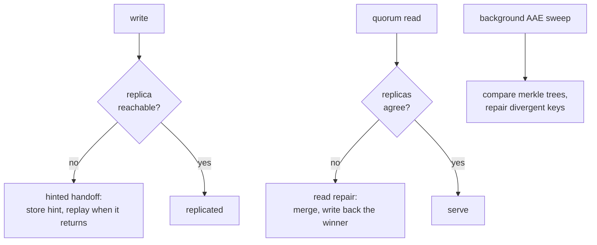
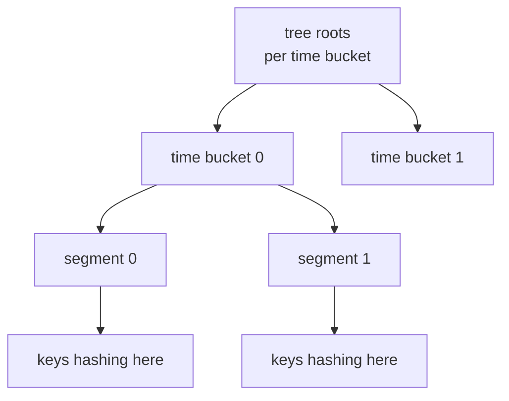

# Anti-Entropy and Repair

An eventually-consistent, masterless store lets a write land on some
replicas but not others -- a node was briefly down, a partition dropped
a message, a hint was never delivered. Left alone, replicas of the same
key drift apart. *Anti-entropy* is the machinery that finds that drift
and reconciles it, in the background, without any client involvement.
This chapter covers the three layers Dyniak uses to keep replicas
converging: read repair on the hot path, hinted handoff for
briefly-absent peers, and active anti-entropy (AAE) as the continuous
background sweep. It ties into the substrate's failure-handling model in
[Anti-entropy](../architecture/failure.md).

## The three layers of repair


<p class="dyn-caption">Three complementary repair layers. Hinted handoff
patches writes to a peer that was briefly away; read repair fixes
divergence it happens to observe on a quorum read; AAE is the continuous
sweep that finds divergence nobody read. Together they drive the cluster
toward convergence.</p>

<dl class="dyn-facts">
<dt>Hinted handoff</dt>
<dd>When a write's target replica is unreachable, a fallback node stores
a <em>hint</em> and replays the write to the real owner when it returns.
An explicit FSM drives the chunked, throttled transfer. Same shape as
Riak's handoff.</dd>
<dt>Read repair</dt>
<dd>A quorum read that sees divergent replicas merges them (by causal
context, or by CRDT merge for a data type) and writes the reconciled
value back to the stale replicas before answering the client.</dd>
<dt>Active anti-entropy (AAE)</dt>
<dd>A continuous background process that compares replicas by exchanging
merkle-tree summaries and repairs the divergent keys -- catching the
drift that no read ever touched.</dd>
</dl>

Read repair and hinted handoff are opportunistic: they only fix what a
request happens to expose. AAE is the safety net that guarantees
convergence for cold data.

## Active anti-entropy: the Tictac tree

Dyniak's AAE is modelled on Riak's continuously-running merkle-tree
synchroniser (the "Tictac" tree). Each node maintains a rolling merkle
tree over its `(bucket, key, causal-context)` tuples. Two peers
periodically exchange tree summaries; where the summaries differ, they
drill down to the exact divergent keys and repair them.

The tree is two levels deep. The top level splits the keyspace into
*time buckets*; each time bucket splits into *segments*. A key hashes
to one (time-bucket, segment) leaf, and its content hash mixes into that
leaf's rolling hash. Changing a key flips its leaf, which flips its
segment root, which flips its time-bucket root -- so a divergence is
visible at the top of the tree and located by descending.


<p class="dyn-caption">The two-level Tictac tree. A key mixes into one
(time-bucket, segment) leaf; a change ripples up to the roots. Peers
compare roots first, then descend only into the diverging subtree.</p>

### The three-phase exchange

When two peers compare trees they run a three-phase protocol, each phase
narrowing the scope, so the amount of data on the wire is proportional
to the divergence and not to the dataset:

1. **ROOT-SYNC** exchanges the top-level per-time-bucket root vector.
   Identical roots mean identical data for that time bucket -- no
   further work.
2. **TREE-SYNC** recurses into one diverging time bucket and exchanges
   its per-segment hash vector, isolating the diverging segments.
3. **KEY-SYNC** enumerates the diverging keys in one (time-bucket,
   segment) pair and hands them to the repair scheduler.

The exchange rides the substrate's entropy channel -- length-prefixed
framing over an AES-128-CBC reconciliation link -- so the tree summaries
travel encrypted between peers.

### Repair: choosing the winner

Once KEY-SYNC surfaces a divergence, the repair scheduler decides which
side holds the correct value and enqueues a repair task on the
per-peer outbound channel -- the same channel gossip and hinted handoff
use. The winner is chosen by causal context: the merkle tree treats
contexts as opaque bytes, and a pluggable comparator decides the order.
The default project comparator is the Interval Tree Clock the rest of
Dyniak uses for per-key causality (see
[Buckets, Keys, and Objects](./objects.md#causal-context)).

```admonish note title="Ambiguous clocks are not silently dropped"
If a divergence's only entry has an unparseable causal context, the
scheduler surfaces an explicit "ambiguous clock" event rather than
guessing a winner or silently discarding the key. An operator can see
it; the repair does not quietly lose data. This is a deliberate
safety choice.
```

For CRDT keys the reconciliation is even cleaner: two divergent replicas
of a CRDT do not need a winner at all -- they *merge*, and the merge is
the correct converged value by construction (see
[Convergent Data Types](./crdts.md)). AAE ships the states both ways and
each side merges.

## Configuring AAE

AAE is off by default and enabled per pool. The cadence and tree shape
are operator knobs:

```yaml
dyn_o_mite:
  data_store: dyniak
  noxu_path: /var/lib/dynomite/noxu
  riak:
    pbc_listen: 127.0.0.1:8087
    http_listen: 127.0.0.1:8098
    aae_enabled: true
    aae_full_sweep_interval_seconds: 86400   # one full sweep per day
    aae_segment_interval_seconds: 60         # one exchange tick per minute
```

<dl class="dyn-facts">
<dt>aae_enabled</dt>
<dd>Spawn the AAE scheduler. Default <code>false</code>.</dd>
<dt>aae_full_sweep_interval_seconds</dt>
<dd>The cadence over which one full sweep across every peer pair
completes. Default 86400 (24 hours).</dd>
<dt>aae_segment_interval_seconds</dt>
<dd>The cadence of one (peer, time-bucket) exchange tick. Default 60.
Must be less than or equal to the full-sweep interval.</dd>
</dl>

The tree shape itself -- number of time buckets, segments per time
bucket, time-window width, snapshot cadence -- has sensible defaults and
is validated at startup (a zero segment count or an out-of-range time
bucket count is rejected). The tree is persisted across restarts, so a
node that comes back does not rebuild its tree from a full keyspace
scan.

```admonish tip title="Tuning the cadence"
More frequent ticks converge faster but cost more background bandwidth
and CPU. The defaults -- a daily full sweep, a per-minute tick -- suit a
steady workload. Shorten the segment interval if you need divergence
closed faster after partitions; lengthen it on a bandwidth-constrained
link. The validator enforces
<code>segment_interval &lt;= full_sweep_interval</code>.
```

## The divergence-proportional alternative: MST reconcile

The fixed-grid Tictac tree walks every segment root on each exchange, so
its comparison cost grows with the dataset even when the divergence is
tiny. Dyniak ships an optional alternative that scales with the
*divergence* instead: a Merkle Search Tree (MST) reconcile.

Instead of a fixed segment grid, the MST reconcile builds a content-
addressed tree over the actual key set and diffs it against a peer's
MST. The diff yields exactly the keys present-or-differing on one side,
at a cost proportional to the *symmetric difference* of the two key
sets -- not their total size. On a large, mostly-in-sync cluster where a
partition touched a handful of keys, the MST path transfers work for
those keys and little else.

```admonish note title="Road not taken -- and taken as an option"
The MST reconcile does not replace the Tictac tree; it is selected by a
config knob (<code>reconcile_mode</code>) and defaults to
<code>Tictac</code>, so a deployment that has not opted in behaves
byte-for-byte as before. The Tictac path is the compatible default
(it is what Riak did); the MST path is there for operators whose
dataset is large enough that fixed-grid comparison cost hurts. Both use
the same storage fold to build their trees and the same exchange
plumbing to ship repairs. See
[Roads Not Taken](../reference/roads-not-taken.md).
```

The MST reconcile also composes with delta shipping: a value change
flips exactly one MST entry (the entry's value side is a content digest
of the object), just as it flips exactly one Tictac leaf, so a change is
located and shipped precisely.

## How divergence is reconciled, end to end

Putting the layers together, here is the life of a divergence:

1. A write reaches replicas 1 and 2 but not replica 3 (it was briefly
   down). If a fallback node held a hint, hinted handoff replays the
   write to replica 3 when it returns -- and the divergence never
   outlives the outage.
2. If no hint covered it, a later quorum read that touches replica 3
   sees it disagree with 1 and 2, merges, and writes the winner back
   (read repair).
3. If nobody reads the key, the next AAE sweep compares replica 3's
   merkle tree with a peer's, drills down to the divergent key, and
   repairs it in the background.

No single layer is sufficient alone; together they guarantee that a key
written to a quorum is not lost and that replicas converge, whether or
not anyone reads the data again.

## Where to next

* [Convergent Data Types](./crdts.md) -- why CRDT keys reconcile by
  merge rather than by winner selection.
* [Buckets, Keys, and Objects](./objects.md#causal-context) -- the
  causal context AAE uses to pick a winner.
* [Anti-entropy](../architecture/failure.md) -- the substrate-level
  failure-handling and repair model.
* [Riak mode ops](../operations/riak.md#active-anti-entropy-aae) -- the
  operator view of the AAE scheduler.
