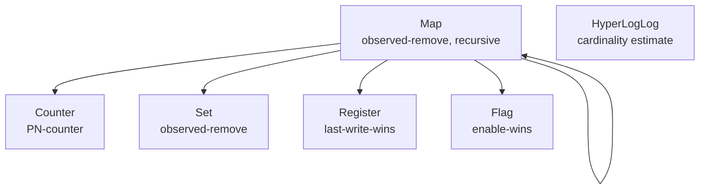

# Convergent Data Types

The previous chapter left you with a choice on every concurrent write:
keep siblings and resolve them yourself, or let last-write-wins silently
drop one. Convergent data types -- CRDTs -- give you a third option that
is almost always the right one for structured values. A CRDT merges
concurrent writes *automatically and correctly*, with no sibling
handling and no lost write, because the merge is defined by the data
type's algebra rather than by a timestamp race or a human callback.

This chapter explains why CRDTs work, walks the six types Dyniak ships,
and shows the API for each.

## Why CRDTs

A CRDT is a data type whose merge operation is *associative*,
*commutative*, and *idempotent*. Those three laws are what make it safe
in an eventually-consistent, masterless store:

<dl class="dyn-facts">
<dt>Commutative</dt>
<dd><code>merge(a, b) == merge(b, a)</code>. The order in which two
replicas exchange state does not matter.</dd>
<dt>Associative</dt>
<dd><code>merge(merge(a, b), c) == merge(a, merge(b, c))</code>. The
order in which three or more replicas' states combine does not
matter.</dd>
<dt>Idempotent</dt>
<dd><code>merge(a, a) == a</code>. Receiving the same state twice -- a
retransmit, a re-read during anti-entropy -- changes nothing.</dd>
</dl>

Together these give *strong eventual consistency*: any two replicas that
have received the same set of updates, in any order, with any
duplicates, converge to exactly the same value. No coordination, no
locks, no consensus round. A replica can accept a write while
partitioned from the rest of the cluster, and when the partition heals,
the merge reconciles the divergence deterministically.

```admonish note title="Road not taken: CRDTs instead of last-write-wins only"
Riak (and Dyniak) can resolve conflicts with last-write-wins, but that
throws away one of two concurrent writes based on a clock comparison --
and clocks skew. CRDTs were added precisely so that the common
structured values (a counter, a set of tags, a nested map) never need
to lose a write. The cost is that the merge is fixed by the type: you
cannot define an arbitrary application-specific merge for a CRDT the way
you can for a sibling set. For values whose merge is a count, a union,
or a field-wise combine, that trade is a bargain. See
[Roads Not Taken](../reference/roads-not-taken.md).
```

Every type below satisfies all three laws; property tests in the crate
(`crates/dyniak/tests/datatypes_properties.rs`) exercise associativity,
commutativity, and idempotence on randomly generated states.

## Actors

CRDTs track *who* made each change so the merge can tell concurrent
edits apart. Riak keyed this by an Erlang `vnode_id` tuple; Dyniak uses
an `ActorId`, the `(datacenter, peer)` pair the Dynomite substrate
already publishes through gossip. The pair is stable across gossip
rounds and totally ordered, which is exactly what an OR-Set tag
generator and a register tiebreaker need.

```rust
use dyniak::datatypes::ActorId;

let a = ActorId::new("dc1", "peer-a");
let b = ActorId::new("dc1", "peer-b");
assert!(a < b);   // lexicographic on (dc, peer)
```

## The six types

Dyniak ships the same six data types Riak did. Four are primitive; the
map composes them; the HyperLogLog is a cardinality estimator.


<p class="dyn-caption">The six Dyniak CRDTs. A Map field may hold any
primitive type or, recursively, another Map -- the same composition
Riak's riak_dt_map offers.</p>

### Counter

A positive-negative counter (`PnCounter`). Internally it is a pair of
per-actor grow-only counts; the value is `sum(positive) -
sum(negative)`, and merge is the element-wise maximum of each actor's
count. That maximum is what makes concurrent increments on different
replicas both survive.

```rust
use dyniak::datatypes::{ActorId, Crdt, PnCounter};

let a = ActorId::new("dc1", "a");
let b = ActorId::new("dc2", "b");

// Two replicas increment independently while partitioned.
let mut left = PnCounter::new();
left.increment(&a, 5);

let mut right = PnCounter::new();
right.increment(&b, 3);
right.decrement(&b, 1);

// Partition heals; the two states merge.
left.merge(&right);
assert_eq!(left.value(), 5 + 3 - 1);   // 7 -- neither increment lost
```

Over the wire this is a `DtUpdateReq` carrying a counter op. A common
use is a page-view or like counter that many nodes bump concurrently.

### Set

An observed-remove set (`OrSet`) of arbitrary byte-string elements.
Each add mints a fresh per-actor tag; a remove tombstones only the tags
it has *observed*. The rule is "add wins": a concurrent add and remove
of the same element resolves to present, because the add carries a tag
the remove never saw.

```rust
use dyniak::datatypes::{ActorId, Crdt, OrSet};

let a = ActorId::new("dc1", "a");
let b = ActorId::new("dc2", "b");

let mut left = OrSet::new();
left.add(&a, "red");
left.add(&a, "green");

// Concurrently, replica b adds "blue" and removes "green"
// (b had observed green before removing it).
let mut right = left.clone();
right.add(&b, "blue");
right.remove(b"green");

left.add(&a, "green");   // a re-adds green concurrently -> add wins
left.merge(&right);

assert!(left.contains(b"red"));
assert!(left.contains(b"blue"));
assert!(left.contains(b"green"));   // survived: the re-add's tag was unseen
```

Use a Set for tag lists, group memberships, or any collection where
concurrent add and remove must both be respected.

### Register

A last-write-wins register (`LwwRegister`). State is
`(value, timestamp, actor)`; merge picks the higher timestamp, breaking
ties by the higher actor id. Unlike bucket-level last-write-wins, a
register is a deliberate, typed choice: you are saying "for this field,
newest wins" and you get a deterministic tiebreak instead of a silent
sibling. Registers are most useful as fields inside a Map.

### Flag

An enable-wins boolean (`EwFlag`) -- an OR-Set restricted to a singleton
domain. Concurrent enable and disable resolves to enabled. Use it for a
feature toggle or a "seen" bit where turning it on should not be lost to
a concurrent turn-off.

### Map

An observed-remove map (`Map`), ORSWOT-style. It is keyed by a
`FieldKey` -- a `(name, type)` pair -- and each value is one of the four
primitives or, recursively, another Map. Two fields with the same name
but different types are distinct, which is how a map namespaces its
fields. Field presence follows the same add-wins rule as the Set:

```rust
use dyniak::datatypes::map::FieldType;
```

The field types a map may carry are `Counter`, `OrSet`, `LwwRegister`,
`EwFlag`, and `NestedMap`. A worked example: a user profile as a map
with a `visits` counter, an `interests` set, and a `name` register, all
merging independently.

```admonish tip title="Removal keeps the value, tombstones the tags"
When you remove a field from a Map, Dyniak leaves the underlying CRDT
value intact and only tombstones its add-tags. A later re-add through
the same actor mints a fresh tag and re-exposes the field. This is a
small, documented divergence from Riak's exact removal bookkeeping; the
observable add-wins semantics are the same. See the module docs in
`crates/dyniak/src/datatypes/map.rs`.
```

### HyperLogLog

A probabilistic cardinality estimator (`HyperLogLog`). It answers "how
many distinct elements have been added?" with a small, fixed-size state
and a bounded error, and it merges by taking the per-register maximum --
the same lattice join pattern as the counter. Use it to count unique
visitors or unique keys touched without storing every element.

## How convergence plays out on the ring

The laws are abstract; here is what they buy you operationally. Two
replicas of the same CRDT key diverge under a partition, then reconcile:

```mermaid
sequenceDiagram
  participant R1 as replica 1
  participant R2 as replica 2
  Note over R1,R2: network partition
  R1->>R1: increment counter (+5)
  R2->>R2: increment counter (+3)
  Note over R1,R2: partition heals; anti-entropy runs
  R1->>R2: ship state {r1: +5}
  R2->>R1: ship state {r2: +3}
  Note over R1: merge -> {r1:+5, r2:+3} = 8
  Note over R2: merge -> {r1:+5, r2:+3} = 8
```
<p class="dyn-caption">Both replicas accepted a write during the
partition; the anti-entropy exchange ships state both ways; the merge
is order-independent and idempotent, so both converge to 8. No write
was lost and no coordination was needed.</p>

The exchange that carries CRDT state between replicas is the same
anti-entropy machinery described in
[Anti-Entropy and Repair](./aae.md).

```admonish note title="Implementation status: write and read convergence"
A write applies to the coordinating node and fans the merged state to
the key's replica set, where each replica merges it idempotently
(element-wise max), so **every replica converges** and no update is lost
or double-counted. This is validated at scale under partitions and node
churn: a multi-region chaos run reports zero lost updates and zero
over-counts.

A read (`DtFetch`) coordinates across the replica set: the coordinating
node fans the fetch to the key's replicas, merges their states, and
answers with the converged value, also writing the merged state back
locally (read repair). A fetch to any node therefore returns the full
value when the transport supports request/response; on a fire-and-forget
transport it falls back to the local value with anti-entropy as the
convergence backstop. Full quorum read semantics (R / PR) for opaque
non-CRDT objects remain tracked follow-up.
```

## Choosing a type

<dl class="dyn-facts">
<dt>A running total</dt>
<dd>Counter. Increments and decrements from any replica all count.</dd>
<dt>A collection with add and remove</dt>
<dd>Set. Concurrent add wins over remove.</dd>
<dt>A single "newest wins" value</dt>
<dd>Register, usually as a Map field.</dd>
<dt>A boolean where "on" should stick</dt>
<dd>Flag (enable-wins).</dd>
<dt>A structured record</dt>
<dd>Map, composing the above; nest maps for sub-records.</dd>
<dt>An approximate distinct count</dt>
<dd>HyperLogLog.</dd>
<dt>An arbitrary opaque blob with a custom merge</dt>
<dd>Not a CRDT -- use a plain object with siblings and resolve in the
application. See <a href="./objects.md#siblings-and-conflict-resolution">siblings</a>.</dd>
</dl>

## Where to next

* [Distributed Transactions](./transactions.md) -- when you need atomic
  updates across *several* keys at once, which no single CRDT gives you.
* [Anti-Entropy and Repair](./aae.md) -- how CRDT state actually flows
  between replicas.
* [Buckets, Keys, and Objects](./objects.md) -- the plain-object model
  CRDTs sit alongside.
