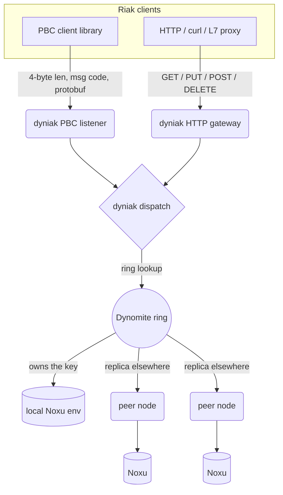

# Introduction to Dyniak

<div class="dyn-hero">
<span class="dyn-tagline">A Riak-compatible front door for a
distributed Rust store.</span>

Dyniak speaks the wire protocols a Riak KV cluster spoke -- Protocol
Buffers over TCP and JSON over HTTP -- and bridges them to the Dynomite
ring on top of the transactional Noxu storage engine. The clients keep
working; the Erlang goes away.
</div>

This part of the manual is a getting-started guide and reference for
Dyniak, the Riak-compatible protocol layer. It is written to be read
front to back the first time and dipped into by section afterwards. If
you have run a Riak cluster before, most of what follows will feel
familiar: buckets and keys, per-request quorums, siblings, secondary
indexes, MapReduce, CRDTs, and active anti-entropy are all here. What
is new is where they run -- on the Dynomite substrate described in
[The Dynomite Engine architecture](../architecture.md) -- and a small
set of capabilities Riak never shipped, chief among them cross-node
XA transactions.

```admonish tip title="New to Dyniak? Start hands-on."
Read this chapter for the shape of the system, then jump to
[Getting Started with Dyniak](./getting-started.md) to build the
server, write your first object, and grow to a small cluster. Come
back here when you want the map of the territory.
```

## What Dyniak is

Dyniak is one of three protocol layers Dynomite can present to clients.
The other two -- Redis / Valkey RESP and the Memcache binary and ASCII
protocols -- are covered under [Protocols](../protocols/index.md).
Dyniak is the Riak-shaped one:

<dl class="dyn-facts">
<dt>Wire compatible</dt>
<dd>Riak's PBC (Protocol Buffers Client) binary protocol on a TCP
listener, plus an HTTP gateway with Riak's
<code>/buckets/&lt;bucket&gt;/keys/&lt;key&gt;</code> route shape. The
same Riak client libraries connect unmodified.</dd>
<dt>Object model</dt>
<dd>Buckets, keys, values with content types, per-object secondary
indexes, links, and causal context. See
<a href="./objects.md">Buckets, Keys, and Objects</a>.</dd>
<dt>Convergent data types</dt>
<dd>Convergent data types (CRDTs) that merge concurrent writes
automatically. Counter and Set are reachable over the wire today;
Register, Flag, Map, and HyperLogLog exist in the codebase and are
tracked to be wired next. See
<a href="./crdts.md">Convergent Data Types</a>.</dd>
<dt>Transactions</dt>
<dd>Cross-node multi-key atomic updates over two-phase commit, plus a
non-blocking read-atomic path. This is beyond Riak. See
<a href="./transactions.md">Distributed Transactions</a>.</dd>
<dt>Query</dt>
<dd>Secondary-index (2i) queries, MapReduce with optional WebAssembly
phases, link walking, and durable full-text / vector / regex search.
See <a href="./mapreduce.md">Secondary Indexes and MapReduce</a> and
<a href="./search.md">Full-Text, Vector, and Regex Search</a>.</dd>
<dt>Repair</dt>
<dd>Merkle-tree active anti-entropy, read repair, hinted handoff, and
an optional divergence-proportional Merkle-Search-Tree reconcile. See
<a href="./aae.md">Anti-Entropy and Repair</a>.</dd>
</dl>

## The Riak-compatibility promise, precisely

Dyniak aims to occupy the socket a Riak cluster used to occupy so that
client applications keep working. That promise has an honest boundary,
and it is worth stating up front so you are not surprised later.

What is compatible:

* The PBC operation set (Ping, ServerInfo, Get, Put, Del, GetBucket,
  SetBucket, ListBuckets, ListKeys, Index, MapRed) and the HTTP route
  shapes.
* Per-request quorum fields (`R`, `W`, `PR`, `PW`, `DW`, `RW`) are
  accepted on the wire for compatibility but not yet enforced (see the
  status note below).
* Conflict handling: racing writes are detected via the causal context
  and resolved to a single value; sibling sets are not yet surfaced to
  clients (use a CRDT for concurrent-write correctness).
* Bucket properties (`n_val`, `allow_mult`, `last_write_wins`, and the
  rest) declared, not auto-created, per Riak semantics. Only `n_val`
  currently changes behavior.
* CRDT merge semantics for the implemented data types (counter, set,
  register, flag; map and HyperLogLog are tracked follow-up).

Where the byte shape differs:

```admonish warning title="Causal context is opaque, not byte-identical"
Dyniak tracks per-key causality with an Interval Tree Clock (ITC), not
Riak's dotted version vector (DVV). The context blob travels in the
same header slot, and a client that treats the context as opaque --
reads it, holds it, echoes it back on the next write -- keeps working
without modification. A client that cracks the blob open and parses it
as a Riak DVV needs a switched decoder. The rationale is in
[Buckets, Keys, and Objects](./objects.md#causal-context) and the ITC
citation is in [Riak mode ops](../operations/riak.md#causality-tracking).
```

What is deliberately out of scope:

* Strong-consistency mode (Riak's `riak_ensemble`). Dyniak is honest
  about being eventually consistent. If you need linearizable
  single-object reads across the cluster, use a different store.
* Cross-datacenter realtime replication (Riak's `riak_repl`). The
  substrate -- gossip, ring ownership, anti-entropy -- is in place;
  the realtime queue is a follow-up.

## The Basho and Riak heritage

Dyniak exists because of two decades of work by the engineers at Basho
and the broader Riak open-source community. Riak was the canonical
real-world implementation of the Amazon Dynamo paper (DeCandia et al.,
SOSP 2007): a masterless, ring-distributed, eventually-consistent
key-value store with configurable per-request quorums, vnode-based
partitioning, hinted handoff, read repair, active anti-entropy, sloppy
quorums, secondary indexes, CRDTs, MapReduce, and a production-tested
operations story. Many patterns now standard in distributed databases
-- consistent-hash rings with virtual nodes, quorum tuples exposed at
the API level, sibling-aware writes -- were first widely deployed in
Riak.

The `riak_core`, `riak_kv`, `riak_pipe`, `riak_search`, and `riak_dt`
Erlang/OTP code is the reference implementation for an entire category
of systems. Dyniak is downstream of that thinking. Its explicit goal is
to make it possible to drop a Dyniak-fronted Dynomite node into a slot a
Riak cluster used to occupy and have client applications keep working.
The full acknowledgement lives in the `crates/dyniak/README.md` and the
project `NOTICE`.

## Where Dyniak sits

Dynomite is the cluster substrate: consistent hashing, gossip, virtual
nodes, quorum, hinted handoff, read repair, and anti-entropy. Dyniak is
a thin protocol layer in front of it that owns only the Riak-specific
pieces -- the wire codec, the request dispatch, and the storage bridge
-- and reuses everything else.


<p class="dyn-caption">A Riak client speaks PBC or HTTP to any node.
Dyniak decodes the request, hands it to the Dynomite ring, and the ring
serves it from the local Noxu environment or forwards it to the owning
peers over the DNODE peer plane. The client never learns the
topology.</p>

Two facts about that picture matter operationally:

1. **The backend is Noxu.** Dyniak is served against an in-process,
   transactional [Noxu](https://codeberg.org/gregburd/noxu) environment
   -- an embedded B+tree engine. A Dyniak pool opens the environment at
   its configured `noxu_path:` and serves the Riak surface directly
   against it. It does **not** run a RESP client proxy and does not
   dial an external Redis backend; all traffic enters through the PBC
   and HTTP listeners.

2. **The feature is opt-in.** Dyniak is compiled into `dynomited` only
   when built with `--features riak`. Operators who do not run Riak
   workloads pay nothing for the extra dependencies and listeners.

```admonish note title="Road not taken: Noxu, not a bolt-on KV"
Riak shipped Bitcask, eLevelDB, and LevelEd as pluggable backends.
Dyniak's storage trait is equally pluggable, but the default is Noxu
because Dyniak needs a backend that supports real transactions --
single-node atomic batches and X/Open XA branches -- to offer the
cross-node transactions in [Distributed Transactions](./transactions.md).
A log-structured KV with no transaction support could serve the object
model but not the transaction model. See
[Roads Not Taken](../reference/roads-not-taken.md).
```

## When to use Dyniak

Reach for Dyniak when:

* You operate a Riak cluster today and want to migrate off the
  end-of-life Erlang stack while keeping the client API contract.
* You want Riak's data model -- buckets, siblings, CRDTs, 2i,
  MapReduce -- on a Rust runtime with built-in OpenTelemetry traces and
  Prometheus metrics.
* You need multi-key atomic updates that Riak's per-key model could not
  give you, without adopting a heavyweight consensus system.

Reach for a different Dynomite protocol layer, or a different store,
when:

* Your clients already speak Redis or Memcache; use the RESP or
  Memcache layer instead (see [Protocols](../protocols/index.md)).
* You need strong single-object consistency across the cluster; Dyniak
  is eventually consistent by design.

## The road through these chapters

The chapters build on each other:

1. [Getting Started with Dyniak](./getting-started.md) -- build, config,
   first object, small cluster.
2. [Buckets, Keys, and Objects](./objects.md) -- the data model and
   conflict resolution.
3. [Convergent Data Types](./crdts.md) -- CRDTs and why they beat
   last-write-wins.
4. [Distributed Transactions](./transactions.md) -- XA / 2PC and the
   read-atomic path.
5. [Links and Link Walking](./links.md) -- object graphs.
6. [Secondary Indexes and MapReduce](./mapreduce.md) -- query and
   aggregation.
7. [Full-Text, Vector, and Regex Search](./search.md) -- the `FT.*`
   surface.
8. [Anti-Entropy and Repair](./aae.md) -- how divergence is reconciled.

For the exact wire surface see [Dyniak wire protocols](../protocols/dyniak.md);
for operator concerns see [Riak mode ops](../operations/riak.md) and
[Dyniak features ops](../operations/dyniak-features.md).
