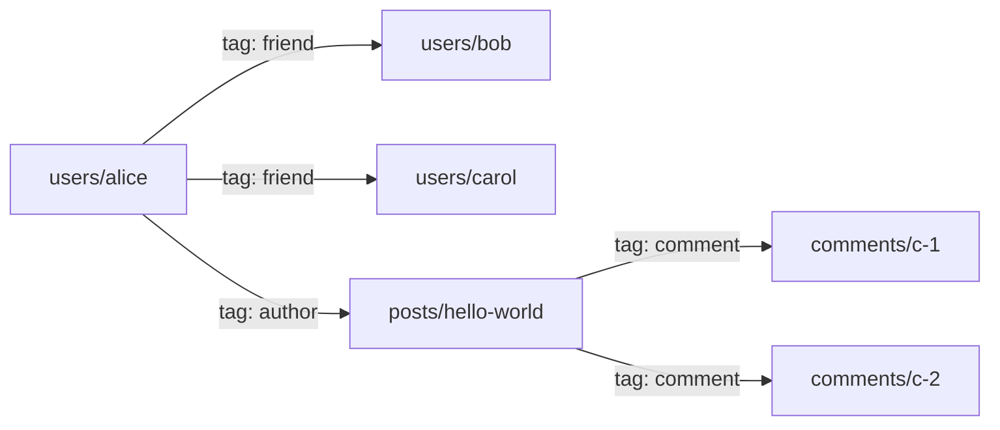
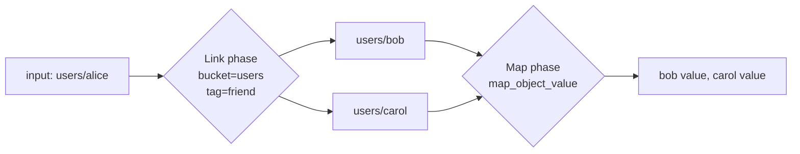

# Links and Link Walking

Riak let an object carry typed *links* to other objects, turning a flat
key/value store into a navigable graph: a user links to their friends, a
blog post links to its comments, an order links to its line items.
Dyniak keeps that model. This short chapter covers how links are stored,
how they ride on each wire protocol, and how you traverse them -- which,
in Dyniak as in Riak, is done through MapReduce rather than a dedicated
route.

## What a link is

A link is a typed pointer from one object to another: a
`(bucket, key, tag)` triple. The `tag` names the *kind* of relationship
-- `friend`, `author`, `parent` -- so one object can link to many others
with different meanings.


<p class="dyn-caption">An object graph built from links. Each edge is a
(bucket, key, tag) triple stored on the source object; the tag names the
relationship so a single object can carry many kinds of link.</p>

Links live *on the source object*. They are part of the object's
metadata, alongside its content type and secondary indexes (see
[Buckets, Keys, and Objects](./objects.md)). Adding, changing, or
removing a link is just storing the object with a different link list.

## Storing links

Over HTTP, links ride in the `Link` header, using the same grammar Riak
used. Each link-value names the target resource and carries a `riaktag`
parameter:

```sh
curl -X PUT http://127.0.0.1:8098/buckets/users/keys/alice \
  -H 'Content-Type: application/json' \
  -H 'Link: </buckets/users/keys/bob>; riaktag="friend", </buckets/users/keys/carol>; riaktag="friend"' \
  -d '{"value": "Alice Liddell"}'
```

The gateway accepts both the modern `/buckets/<bucket>/keys/<key>`
resource form and the legacy `/riak/<bucket>/<key>` form, matches
`riaktag` or `tag` case-insensitively, and honours several `Link:`
header lines or several comma-separated values in one line. A
link-value that lacks a tag, or whose resource is not an object path, is
skipped rather than rejected -- the same lenient parse Riak used.

You can also carry links inside the JSON envelope directly:

```json
{
  "value": "Alice Liddell",
  "links": [
    {"bucket": "users", "key": "bob",   "tag": "friend"},
    {"bucket": "posts", "key": "hello", "tag": "author"}
  ]
}
```

On read, the gateway re-emits the object's links as `Link` headers,
plus a synthesized bucket-up link so a client can navigate from an
object back to its bucket:

```
Link: </buckets/users>; rel="up"
Link: </buckets/users/keys/bob>; riaktag="friend"
```

```admonish note title="rel=up links are navigation, not object links"
The `rel="up"` bucket link points at a bucket, not an object, so it
carries no key and no tag. It is not a link a traversal can walk; the
gateway skips it on parse and re-synthesizes it on read. Only
`(bucket, key, tag)` object links are walkable.
```

Over PBC, links are `RpbLink` entries inside the object's `RpbContent`
message -- the same slot the value and content type occupy. A Riak
client library exposes them through its usual link API:

```python
import riak

client = riak.RiakClient(host='127.0.0.1', pb_port=8087)
users = client.bucket('users')

alice = users.new('alice', data='Alice Liddell')
bob = users.new('bob', data='Bob')
alice.add_link(bob, tag='friend')
alice.store()
```

## Walking links

Here is the design choice worth calling out: Dyniak has **no dedicated
link-walk route**. Links are traversed by a MapReduce `Link` phase. This
matches Riak, where link-walking was ultimately expressed as a pipeline
phase, and it means link traversal composes with the rest of the
MapReduce toolbox -- you can walk a link and then map over the resolved
objects in one job.

A `Link` phase follows the links on its input objects, optionally
filtered by `bucket` and `tag`, and emits the resolved target objects as
its output. Chain it into a pipeline submitted to `POST /mapred` (HTTP)
or `RpbMapRedReq` (PBC):

```sh
curl -s -X POST http://127.0.0.1:8098/mapred \
  -H 'Content-Type: application/json' \
  -d '{
    "inputs": [["users", "alice"]],
    "query": [
      {"link": {"bucket": "users", "tag": "friend"}},
      {"map":  {"fn_name": "map_object_value"}}
    ]
  }'
```

Read that pipeline as: start from `users/alice`, follow every `friend`
link into the `users` bucket, then extract each resolved friend's value.
The `Link` phase does the graph traversal; the `Map` phase does whatever
you want with the objects it lands on.


<p class="dyn-caption">A two-phase link walk. The Link phase resolves
Alice's friend links to the target objects; the Map phase projects each
target's value. Because it is a MapReduce pipeline, you can add more
phases -- another link hop, a reduce, a sort -- after it.</p>

### Filtering a walk

Both filters on a `Link` phase are optional:

<dl class="dyn-facts">
<dt>bucket</dt>
<dd>Only follow links whose target is in this bucket. Omit to follow
links into any bucket.</dd>
<dt>tag</dt>
<dd>Only follow links with this tag. Omit to follow links of every
tag.</dd>
</dl>

To follow every link Alice has, regardless of kind, drop both filters:

```json
{"link": {}}
```

To walk two hops -- Alice's friends' authored posts -- chain two `Link`
phases:

```json
{
  "inputs": [["users", "alice"]],
  "query": [
    {"link": {"tag": "friend"}},
    {"link": {"bucket": "posts", "tag": "author"}},
    {"map":  {"fn_name": "map_object_value"}}
  ]
}
```

## When to use links

Links are a good fit when the relationships are part of the object and
you want to navigate them on demand. They are not an index: to find "all
objects that link *to* Alice" you would need a secondary index or a
MapReduce over the source bucket, because links are stored on the source
and point outward. For query-by-attribute, reach for
[secondary indexes](./mapreduce.md#secondary-indexes-2i); for graph
navigation from a known starting object, links are the tool.

```admonish tip title="Links plus 2i plus MapReduce compose"
Because link-walking is a MapReduce phase, you can seed a pipeline from
a secondary-index query (find the starting objects by attribute), walk
their links (navigate the graph), and reduce the result (aggregate) --
all in one job. The next chapter covers the 2i and MapReduce halves of
that combination.
```

## Where to next

* [Secondary Indexes and MapReduce](./mapreduce.md) -- the query and
  pipeline machinery that link-walking is built on.
* [Buckets, Keys, and Objects](./objects.md) -- where links live in the
  object model.
* [Dyniak wire protocols](../protocols/dyniak.md#object-links) -- the
  exact link representation on each wire.
