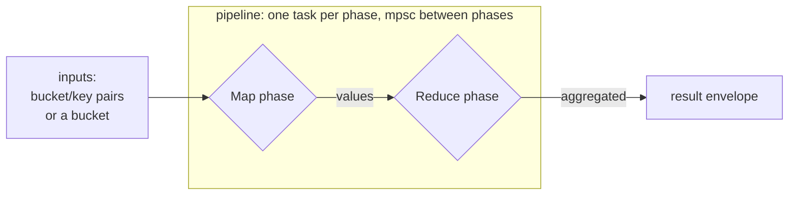

# Secondary Indexes and MapReduce

Objects are addressed by key, but you often need to find them by
*attribute*: every user aged 42, every order placed in a date range.
That is what secondary indexes (2i) are for. And once you can select a
set of objects, you often want to *aggregate* them -- count, sum, sort,
project. That is what MapReduce is for. The two compose: a MapReduce job
can seed itself from a 2i query. This chapter covers both.

## Secondary indexes (2i)

A secondary index attaches searchable `(name, value)` tags to an object
at write time. The index name's suffix picks its type:

<dl class="dyn-facts">
<dt><code>_int</code></dt>
<dd>An integer index. Supports equality and range queries over integer
values.</dd>
<dt><code>_bin</code></dt>
<dd>A binary index. Supports equality and range queries over byte-string
values.</dd>
</dl>

### Attaching index entries

Over HTTP the entries ride in the object envelope or in `X-Riak-Index-*`
headers:

```sh
curl -X PUT http://127.0.0.1:8098/buckets/users/keys/alice \
  -H 'Content-Type: application/json' \
  -d '{
    "value": "Alice",
    "indexes": [
      {"name": "age_int", "value": "42"},
      {"name": "city_bin", "value": "seattle"}
    ]
  }'
```

Over PBC the entries are `RpbPair` items in the `RpbPutReq.indexes`
field, one pair per entry, where the pair key names the index (with its
`_int` or `_bin` suffix) and the pair value carries the value bytes. A
Riak client library exposes this as `add_index`:

```python
o = bucket.new('alice', data='profile')
o.add_index('age_int', '42')
o.add_index('city_bin', 'seattle')
o.store()
```

### Querying an index

Two query types are supported, matching Riak:

```python
# equality: every key whose age_int is exactly 42
hits = bucket.get_index('age_int', '42').results

# range: every key whose age_int is in [10, 50] inclusive
hits = bucket.get_index('age_int', '10', '50').results
```

Over PBC these are `RpbIndexReq` with `qtype: 0` (equality) or
`qtype: 1` (range, inclusive bounds). The current response returns a
single frame with `done = true`; streaming one frame per chunk is a
tracked follow-up.

```admonish note title="Storage layout: a deviation from Riak's schema"
Riak stored 2i entries in a `2i_partition_table`. Dyniak stores them as
plain records inside the same Noxu environment as the primary data,
under three reserved key prefixes -- a primary record, a forward index
(name+value -> key) for the query path, and a reverse index
(key -> name+value list) so a delete or overwrite can clean stale
forward entries. A fixed-width length prefix on the value keeps prefix
scans unambiguous when value bytes contain the structural separator.
The full layout is in
[Riak mode ops](../operations/riak.md#secondary-indexes-2i). The 2i
entries an object carries are written and removed atomically with the
object itself, including inside a transaction (see
[Distributed Transactions](./transactions.md)).
```

## MapReduce

MapReduce runs a pipeline of *phases* over a set of input objects. Each
phase transforms a stream of values into another stream; the phases are
chained, and the last phase's output is the job result. The shape is
Riak's "pipe of phases."

```admonish note title="Road not taken: named Rust phases, not embedded JavaScript"
Riak shipped a JavaScript (and Erlang) MapReduce engine so operators
could ship arbitrary phase code inline. Dyniak takes a different bet: a
fixed registry of named built-in phase functions written in Rust, plus
optional sandboxed WebAssembly for custom phases. The built-ins cover
the common jobs -- extract, count, sum, sort, union, project -- with no
scripting engine to secure or slow down, and the WASM path (below)
gives you custom logic when you need it without embedding a JavaScript
runtime in the data plane. The rationale is in the crate's MapReduce
module docs.
```

### The job envelope

A job has two parts: `inputs` (the seed values) and `query` (the phase
list). Submit it to `POST /mapred` (HTTP) or `RpbMapRedReq` (PBC):

```sh
curl -s -X POST http://127.0.0.1:8098/mapred \
  -H 'Content-Type: application/json' \
  -d '{
    "inputs": [["orders", "o-1"], ["orders", "o-2"], ["orders", "o-3"]],
    "query": [
      {"map":    {"fn_name": "map_object_value"}},
      {"reduce": {"fn_name": "reduce_sum", "keep": true}}
    ]
  }'
```

Inputs can be an explicit list of `(bucket, key)` pairs (above), an
inline list of values, or a bucket name (all keys in the bucket,
enumerated by the executor).

### Built-in phases

The built-in registry ships map and reduce functions named by Riak's
convention (`map_*`, `reduce_*`):

<dl class="dyn-facts">
<dt>map_object_value</dt>
<dd>Extract the object's <code>value</code> field.</dd>
<dt>map_object_value_list</dt>
<dd>Emit each element if the value is a JSON array, else the scalar.</dd>
<dt>map_extract_field</dt>
<dd>Project a named field out of each object.</dd>
<dt>map_identity</dt>
<dd>Pass inputs through unchanged.</dd>
<dt>reduce_count</dt>
<dd>Count the inputs.</dd>
<dt>reduce_sum</dt>
<dd>Sum numeric inputs.</dd>
<dt>reduce_sort</dt>
<dd>Sort the inputs.</dd>
<dt>reduce_set_union</dt>
<dd>Union the inputs into a distinct set.</dd>
<dt>reduce_identity</dt>
<dd>Pass inputs through unchanged.</dd>
</dl>

Two more phase kinds round out the pipeline:

* **`Link`** -- follow object links, optionally filtered by bucket and
  tag. This is how link-walking is expressed; see
  [Links and Link Walking](./links.md).
* **`WasmModule`** -- run a registered WebAssembly module as a map or
  reduce phase. Covered below.

### The data flow


<p class="dyn-caption">A MapReduce pipeline. The executor runs one task
per phase, wired by FIFO channels; the previous phase's output is the
next phase's input, and the final phase's output is collected into the
response. Built-in phases are pure and deterministic, so the same job
over the same inputs is byte-identical across runs.</p>

Because the built-in phases are pure Rust and the channels preserve
FIFO order, a job is deterministic: run it twice against the same
inputs and you get the same bytes.

### Custom phases in WebAssembly

When a job needs logic the built-ins do not cover, a `WasmModule` phase
runs an operator-registered WebAssembly module as a map or reduce step.
This requires two things:

1. The binary is built with the `wasm` feature.
2. The module is registered -- at startup via `riak.wasm_modules:` (a
   list of `{id, path}` entries pointing at `.wasm` or `.wat` files) or
   at runtime.

```json
{
  "inputs": ["events"],
  "query": [
    {"wasm_module": {"id": "sessionize", "kind": "map"}},
    {"reduce": {"fn_name": "reduce_count", "keep": true}}
  ]
}
```

```admonish warning title="WasmModule needs the wasm feature"
Without the `wasm` feature the phase is still parsed and validated, but
submitting a job that contains a `WasmModule` phase returns a
`WasmNotImplemented` error. Build with `--features wasm` and register
the module before you submit. The WASM executor shares its module store,
compilation cache, and resource limits with the custom-keyfun routing
described in [Dyniak features ops](../operations/dyniak-features.md).
```

## Combining 2i, links, and MapReduce

The three tools compose into one pipeline. A job can start from a 2i
query (find objects by attribute), walk their links (navigate the
graph), and reduce the result (aggregate) -- for example, "sum the order
totals of every customer in Seattle":

```json
{
  "inputs": {
    "bucket": "customers",
    "index": "city_bin",
    "key": "seattle"
  },
  "query": [
    {"link":   {"bucket": "orders", "tag": "placed"}},
    {"map":    {"fn_name": "map_extract_field", "arg": "total"}},
    {"reduce": {"fn_name": "reduce_sum", "keep": true}}
  ]
}
```

Read it as: select Seattle customers by 2i, follow each customer's
`placed` links into the `orders` bucket, extract each order's `total`,
and sum them. The 2i seeds the pipeline, the `Link` phase traverses,
and the `map`/`reduce` phases aggregate.

## Where to next

* [Links and Link Walking](./links.md) -- the `Link` phase in detail.
* [Full-Text, Vector, and Regex Search](./search.md) -- richer query
  than 2i's equality and range.
* [Distributed Transactions](./transactions.md) -- writing an object and
  its index entries atomically.
* [Dyniak wire protocols](../protocols/dyniak.md#mapreduce) -- the exact
  MapReduce and index wire surface.
