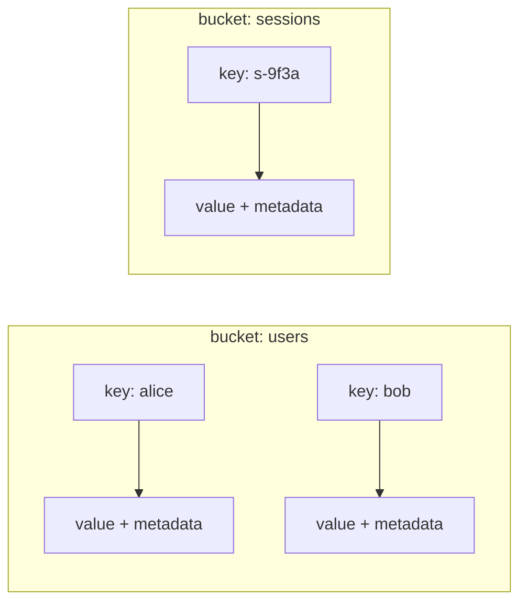
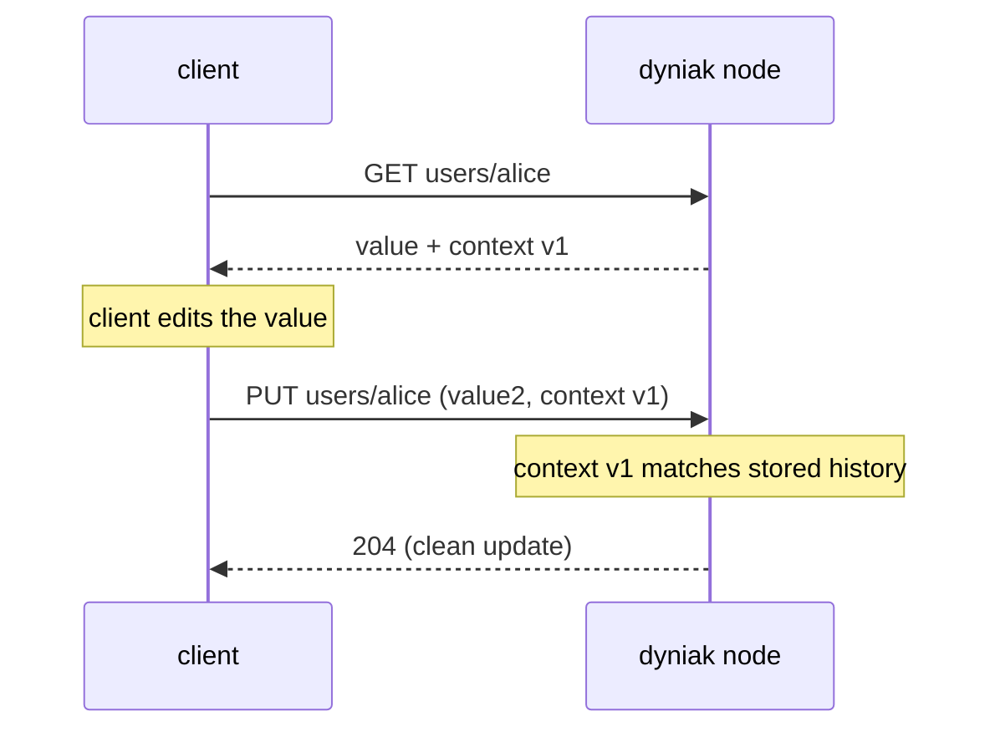
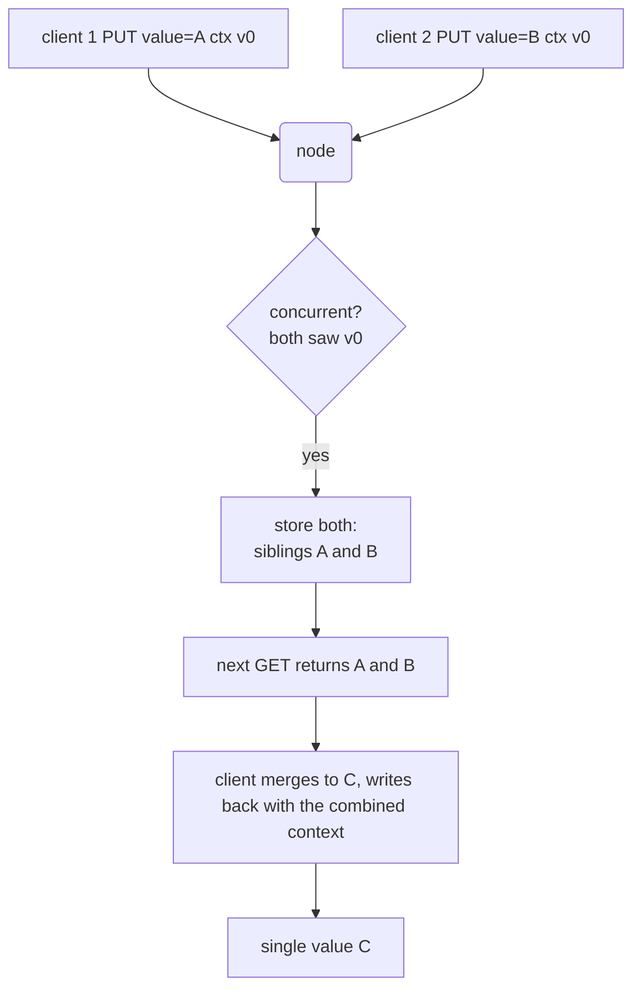

# Buckets, Keys, and Objects

The Dyniak data model is Riak's data model: a flat namespace of
*buckets*, each holding *objects* addressed by a *key*. An object is a
value plus metadata -- a content type, secondary-index entries, links,
and a causal-context blob. This chapter walks the model from the outside
in, then covers the two things that trip up newcomers to a Dynamo-style
store: siblings and conflict resolution.

If you have not yet stood up a node, do that first in
[Getting Started with Dyniak](./getting-started.md); the examples here
assume a running gateway on `127.0.0.1:8098` (HTTP) and `127.0.0.1:8087`
(PBC).

## Buckets and keys

A bucket is a named container for objects. Buckets are cheap: there is
no create step for a plain bucket -- you write an object into a bucket
and the bucket exists. A key is an arbitrary byte string that names an
object inside a bucket. The pair `(bucket, key)` is the object's full
address.


<p class="dyn-caption">A bucket is a flat namespace of keys; each key
addresses one object, which is a value plus its metadata. Buckets do
not nest.</p>

Over HTTP the address is a URL path:

```sh
# address:  bucket "users", key "alice"
curl http://127.0.0.1:8098/buckets/users/keys/alice
```

Over PBC the address is the `bucket` and `key` fields of the request
message. The routing layer hashes the pair (or just the bucket, if the
bucket's `chash_keyfun` property says so -- see below) to choose the
ring position that owns the object.

## The object: value plus metadata

An object carries more than its value. The HTTP envelope makes each
piece explicit:

```json
{
  "value": "Alice Liddell",
  "content_type": "text/plain",
  "indexes": [
    {"name": "age_int", "value": "42"},
    {"name": "city_bin", "value": "seattle"}
  ],
  "links": [
    {"bucket": "users", "key": "bob", "tag": "friend"}
  ]
}
```

The pieces:

<dl class="dyn-facts">
<dt>value</dt>
<dd>The opaque payload. Dyniak stores the bytes verbatim; it does not
interpret them except where a query feature (2i, search, MapReduce)
asks it to.</dd>
<dt>content_type</dt>
<dd>A MIME type describing the value. It is round-tripped, not enforced:
Dyniak stores whatever you send and returns it. Set it so clients (and
MapReduce phases) know how to read the value.</dd>
<dt>indexes</dt>
<dd>Secondary-index entries. Each is a <code>(name, value)</code> pair;
the name suffix <code>_int</code> or <code>_bin</code> selects an
integer or binary index. Covered in
<a href="./mapreduce.md">Secondary Indexes and MapReduce</a>.</dd>
<dt>links</dt>
<dd>Typed pointers to other objects, each a
<code>(bucket, key, tag)</code> triple. Covered in
<a href="./links.md">Links and Link Walking</a>.</dd>
</dl>

### Content types over the wire

Over HTTP, the value's content type is negotiated two ways. The
gateway's transport encoding -- how the whole envelope is serialized --
is chosen from the `Accept` header (`application/json`,
`application/cbor`, or `application/x-protobuf`). The value's own
content type is a field inside the envelope. Because the envelope is
persisted in a canonical, codec-independent form, a value written as
JSON is fetchable as CBOR and vice versa:

```sh
# write as JSON
curl -X PUT http://127.0.0.1:8098/buckets/users/keys/alice \
  -H 'Content-Type: application/json' \
  -d '{"value": "Alice", "content_type": "text/plain"}'

# read the same object as CBOR
curl http://127.0.0.1:8098/buckets/users/keys/alice \
  -H 'Accept: application/cbor' --output alice.cbor
```

Over PBC the value and its content type ride in the `RpbContent`
message; indexes are `RpbPair` entries and links are `RpbLink` entries
inside the same `RpbContent`.

## Bucket properties

A bucket's behaviour is governed by its properties. Fetch them:

```sh
curl -s http://127.0.0.1:8098/buckets/users/props
```

```json
{
  "props": {
    "name": "users",
    "n_val": 3,
    "allow_mult": false,
    "last_write_wins": false,
    "r": "quorum", "w": "quorum",
    "pr": 0, "pw": 0,
    "dw": "quorum", "rw": "quorum",
    "basic_quorum": false,
    "notfound_ok": true
  }
}
```

The properties that matter most day to day:

* **`n_val`** -- the replication factor: how many copies of each object
  the ring keeps. The default is 3.
* **`r` / `w`** -- the default read and write quorums for the bucket, in
  the absence of a per-request override. `"quorum"` means a majority of
  `n_val`.
* **`pr` / `pw`** -- primary-replica read and write quorums: how many of
  the responding replicas must be *primary* owners (not fallback nodes
  holding a hinted-handoff copy).
* **`dw`** -- durable-write quorum: how many replicas must have
  committed the write durably.
* **`allow_mult`** -- whether the bucket keeps siblings on a conflict
  (below).
* **`last_write_wins`** -- whether conflicts are resolved by timestamp
  rather than by keeping siblings.

Set properties with `PUT`:

```sh
curl -X PUT http://127.0.0.1:8098/buckets/users/props \
  -H 'Content-Type: application/json' \
  -d '{"props": {"n_val": 5, "allow_mult": true}}'
```

```admonish note title="Two Dyniak-specific bucket properties"
Beyond the Riak set, Dyniak adds `chash_keyfun` (route on
`<bucket>/<key>`, on `<bucket>` only, or through a custom WASM module)
and `replication_strategy` (per-DC/per-rack quorum fan-out, the
Dynomite default, versus walk-N-successors, the Riak default). Both are
documented with their wire encodings in
[Riak mode ops](../operations/riak.md#bucket-properties).
```

## Causal context

Every object read returns a small *context* blob that encodes the
object's causal history. The client's job is simple: read the blob,
hold it, and echo it back on the next write of the same key. The server
uses the echoed context to decide whether the new write supersedes what
is stored (a normal update) or diverged from it (a conflict).


<p class="dyn-caption">The read-modify-write cycle. The client echoes
the context it read; the server uses it to distinguish a clean update
from a conflict. A client that skips the context risks creating an
unnecessary sibling.</p>

Dyniak encodes the context as an Interval Tree Clock (ITC) rather than
Riak's dotted version vector. The two answer the same question -- did
these two writes see each other, or did they diverge? -- but ITC scales
with the *currently-live* actor population rather than with every actor
that ever participated, which suits Dynomite's dynamic-membership
cluster model. Retired nodes leave no residual cost in the clock.

```admonish warning title="Opaque context: the compatibility boundary"
The context blob is opaque on the wire. A client that round-trips the
bytes verbatim keeps working unchanged. A client that cracks the blob
open and parses it as a Riak DVV must switch decoders, because the byte
shape is ITC, not DVV. This is the one place Dyniak's byte
compatibility with Riak breaks; the semantics are identical, the bytes
are not. The rationale and citations are in
[Riak mode ops](../operations/riak.md#causality-tracking).
```

## Siblings and conflict resolution

Here is the heart of the Dynamo model. Because Dyniak is masterless and
eventually consistent, two clients can write the same key at the same
time without either seeing the other. What happens next depends on the
bucket's properties.

### With `allow_mult: true` (recommended)

The two concurrent writes are *both* kept as *siblings*. A later read of
the key surfaces both values and the client resolves them:


<p class="dyn-caption">Concurrent writes that both descend from the same
context become siblings. The next reader sees both, resolves them into
one value, and writes the resolution back. Siblings are a feature: they
never silently drop a write.</p>

Over HTTP a sibling read is signalled by a `300 Multiple Choices`
status; the client fetches each sibling and resolves. This is the
safe default because it never loses a write.

### With `last_write_wins: true`

The store keeps only the write with the higher timestamp and silently
discards the other. This is simpler for clients -- no sibling handling
-- but it can lose a concurrent write. Use it only when the value is
disposable or the write rate makes conflicts vanishingly rare.

```admonish note title="Road not taken: CRDTs over last-write-wins-only"
Dyniak keeps both `last_write_wins` and sibling-based resolution, but it
also ships convergent data types (CRDTs) as a third, better option for
the common cases -- counters, sets, maps. A CRDT merges concurrent
writes *automatically and correctly* with no sibling handling and no
lost write, because the merge is defined by the data type's algebra
rather than by a timestamp race. If your value is a count, a set, or a
map, reach for a CRDT before you reach for last-write-wins. See
[Convergent Data Types](./crdts.md) and
[Roads Not Taken](../reference/roads-not-taken.md).
```

## A worked read-modify-write

Putting the pieces together, the canonical safe update loop is:

```python
import riak

client = riak.RiakClient(host='127.0.0.1', pb_port=8087)
bucket = client.bucket('users')
bucket.set_property('allow_mult', True)

# fetch (carries the causal context)
obj = bucket.get('alice')

if len(obj.siblings) > 1:
    # resolve the conflict: application-specific merge
    merged = resolve(obj.siblings)
    obj.data = merged
else:
    obj.data = update(obj.data)

# store echoes the context automatically through the client library
obj.store()
```

The client library carries the context for you; the only judgement call
is `resolve()`, and even that disappears if you model the value as a
CRDT. That is the subject of the next chapter.

## Where to next

* [Convergent Data Types](./crdts.md) -- make conflict resolution
  automatic.
* [Links and Link Walking](./links.md) -- connect objects into a graph.
* [Secondary Indexes and MapReduce](./mapreduce.md) -- query objects by
  index value.
* [Dyniak wire protocols](../protocols/dyniak.md) -- the exact PBC and
  HTTP surface.
