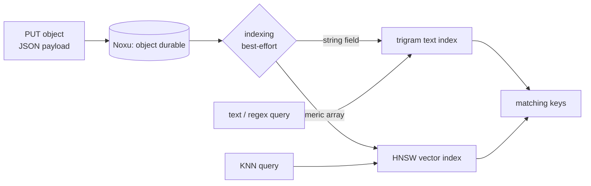

# Full-Text, Vector, and Regex Search

Secondary indexes answer equality and range queries: age is 42, age is
between 10 and 50. That is not enough when you want to find objects by
*what they contain* -- documents mentioning a word, records near a
vector in embedding space, values matching a pattern. Dyniak adds a
durable search layer for exactly that: full-text substring search,
k-nearest-neighbour vector search, and approximate regular-expression
search, all built into the process rather than delegated to a separate
search cluster.

The search surface is gated behind the `search` Cargo feature. This
chapter shows both faces of it: the `FT.*` commands on the RESP plane
(the same surface RediSearch exposes) and the HTTP index/search routes
on the Dyniak gateway.

```admonish note title="Road not taken: in-process search, not Solr"
Riak's search story leaned on Apache Solr -- riak_search 1.x, then
yokozuna in 2.x, both shipping documents out to a co-located Solr
instance. Dyniak does it in-process, inheriting Dynomite's `dyntext`
(trigram funnel plus a TRE-backed approximate-regex matcher) and
`dynvec` (an HNSW graph with turbovec quantisation) crates. The bet is
the same as the rest of the system: fewer moving parts, one durable
store, no second cluster to operate or keep in sync. See
[Roads Not Taken](../reference/roads-not-taken.md).
```

## Two ways to reach the same engine

The text and vector engines are shared. You can drive them two ways:

<dl class="dyn-facts">
<dt>RESP FT.* commands</dt>
<dd>The RediSearch-shaped command surface, spoken over the Valkey / RESP
plane with <code>valkey-cli</code> or any Redis client. This is the path
the <a href="../tutorial-search.md">search tutorial</a> walks end to end.</dd>
<dt>Dyniak HTTP routes</dt>
<dd>Per-bucket index-management and search routes under
<code>/buckets/{b}/index/...</code> and
<code>/buckets/{b}/search/...</code>, so a Riak-shaped deployment can
declare and query indexes over the objects it PUTs.</dd>
</dl>

Both require the `search` feature and a wired-in vector registry.
Without the feature -- or with the feature but no registry -- the search
routes reply `501 Not Implemented`, and the object, list, and
transaction surfaces are unchanged.

## The FT.* command surface

The `FT.*` commands are the fastest way to see the engine work. Build
with `--features riak` (which pulls in search) and point `valkey-cli` at
the node. Create an index over a hash keyspace with a text field and a
vector field:

```sh
valkey-cli -p 18402 FT.CREATE myidx \
  ON HASH PREFIX 1 doc: \
  SCHEMA title TEXT vec VECTOR HNSW 6 TYPE FLOAT32 DIM 4 DISTANCE_METRIC L2
```

Store some rows:

```sh
valkey-cli -p 18402 HSET doc:1 title "hello world" vec "$(python3 -c '...')"
valkey-cli -p 18402 HSET doc:2 title "hello there" vec "$(python3 -c '...')"
```

### Full-text search

Query the text field for a term:

```sh
valkey-cli -p 18402 FT.SEARCH myidx '@title:hello'
```

The text path is a trigram funnel: the query term is broken into
overlapping three-character shingles, the funnel narrows the candidate
set by trigram membership, and the survivors are confirmed by exact
substring match. You can inspect the trigrams the planner extracted:

```sh
valkey-cli -p 18402 FT.EXPLAIN myidx '@title:hello'
```

### Vector search

A KNN query finds the rows whose vectors are nearest the query vector.
The query vector is passed as a binary float blob through a `PARAMS`
clause:

```sh
python3 -c 'import struct,sys; sys.stdout.buffer.write(struct.pack("<4f", 0.1,0.2,0.3,0.4))' \
  | valkey-cli -p 18402 -x FT.SEARCH myidx '*=>[KNN 3 @vec $blob]' PARAMS 2 blob
```

The `[KNN 3 @vec $blob]` clause asks for the 3 nearest neighbours of
`$blob` in the `vec` field. Under the hood this walks the HNSW graph.

### Approximate regex search

`FT.REGEX` is a Dynomite extension beyond RediSearch. It matches a field
against a regular expression with a tunable edit distance `K`:

```sh
# exact regex match (K=0)
valkey-cli -p 18402 FT.REGEX myidx title 'hello' K=0

# allow up to one edit (K=1) -- matches "hallo", "helo", "hellos"
valkey-cli -p 18402 FT.REGEX myidx title 'hello' K=1

# allow up to two edits (K=2)
valkey-cli -p 18402 FT.REGEX myidx title 'hello' K=2
```

`K` is the maximum edit distance; it must be a non-negative integer.
`K=-1`, `K=foo`, and an empty `K=` are all syntax errors. The matcher
is backed by TRE, so full regex syntax works with the approximate
budget:

```sh
valkey-cli -p 18402 FT.REGEX myidx title 'h(e|x)l*o' K=0
```

### Managing indexes

The operations surface mirrors RediSearch:

<dl class="dyn-facts">
<dt>FT.LIST (alias FT._LIST)</dt>
<dd>List every registered index.</dd>
<dt>FT.INFO &lt;name&gt;</dt>
<dd>Schema metadata and index counters.</dd>
<dt>FT.ALTER &lt;idx&gt; ADD &lt;field&gt; &lt;type&gt;</dt>
<dd>Add a field to a live index.</dd>
<dt>FT.DROPINDEX &lt;idx&gt; [DD]</dt>
<dd>Remove the index; with <code>DD</code>, also delete the indexed
rows.</dd>
<dt>FT.EXPLAIN &lt;idx&gt; &lt;query&gt;</dt>
<dd>Show the query plan (the trigrams, or the KNN shape).</dd>
</dl>

The [search tutorial](../tutorial-search.md) walks all of these end to
end with verbatim wire output; treat it as the hands-on companion to
this reference.

## Search over Dyniak objects (HTTP)

The RESP surface indexes a hash keyspace. The Dyniak HTTP gateway lets a
Riak-shaped deployment declare indexes over the *objects it PUTs* and
query them by bucket. For indexing purposes the object's value is
interpreted as a JSON document.

### Declare a text index on a field

```sh
curl -X PUT http://127.0.0.1:8098/buckets/articles/index/text/title
```

This declares a text index on the `title` field. On every subsequent
object write whose JSON payload carries a string under `title`, that
string is fed into the bucket's trigram-backed text index. Query it:

```sh
curl -s 'http://127.0.0.1:8098/buckets/articles/search/text/title?q=machine'
```

Approximate regex over the same field:

```sh
curl -s 'http://127.0.0.1:8098/buckets/articles/search/regex/title?pattern=mach.ne&k=1'
```

### Create a vector index for a bucket

```sh
curl -X POST http://127.0.0.1:8098/buckets/articles/index/vector \
  -H 'Content-Type: application/json' \
  -d '{"dim": 384, "metric": "l2", "field": "embedding"}'
```

A bucket gets one vector index. The JSON body selects the dimension,
distance metric, codec, and the document field carrying the vector
(default `_vector`). On every object write whose JSON payload carries a
numeric array under that field, the array is upserted into the HNSW
engine keyed by the object key; the remaining top-level fields ride
along as row metadata for post-filtering. Query it:

```sh
curl -s -X POST http://127.0.0.1:8098/buckets/articles/search/vector \
  -H 'Content-Type: application/json' \
  -d '{"vector": [0.1, 0.2, ...], "k": 5}'
```

List a bucket's declared indexes:

```sh
curl -s http://127.0.0.1:8098/buckets/articles/index
```

```admonish note title="How indexes bind to buckets"
Each bucket is backed by two registry index names: <code>text:{bucket}</code>
holds the text fields and <code>vec:{bucket}</code> holds the vector
engine. A bucket name containing a colon could in principle collide with
this scheme; in practice bucket names are flat identifiers, so the
collision is documented rather than guarded. Indexing is best-effort on
write: the object is durable first, so an indexing miss never turns a
write into an error.
```

## The durable index

The search index is not a rebuild-on-restart cache. It is durable: the
index state persists across restarts alongside the object data, so a
node that comes back after a crash does not have to re-scan the whole
keyspace to answer a query. Writes update the index as part of the write
path; the index and the objects it covers stay in step.


<p class="dyn-caption">The write path stores the object durably first,
then feeds declared fields into the text and vector indexes. Queries hit
the durable indexes and return matching keys, which the caller can then
fetch as full objects.</p>

## Choosing a query tool

<dl class="dyn-facts">
<dt>Exact attribute match or range</dt>
<dd>Secondary index (2i). Cheaper than search; see
<a href="./mapreduce.md#secondary-indexes-2i">Secondary Indexes</a>.</dd>
<dt>Word or substring in text</dt>
<dd>Text search (FT.SEARCH text field, or the HTTP text route).</dd>
<dt>Fuzzy or pattern match</dt>
<dd>FT.REGEX with an edit-distance budget.</dd>
<dt>Nearest-neighbour in embedding space</dt>
<dd>Vector KNN search.</dd>
</dl>

## Where to next

* [Tutorial: Vector, Text, and Regex Search](../tutorial-search.md) --
  the hands-on, copy-paste walkthrough with real output.
* [Secondary Indexes and MapReduce](./mapreduce.md) -- the structured
  query and aggregation surface search complements.
* [Dyniak features ops](../operations/dyniak-features.md) -- operator
  view of the search feature.
