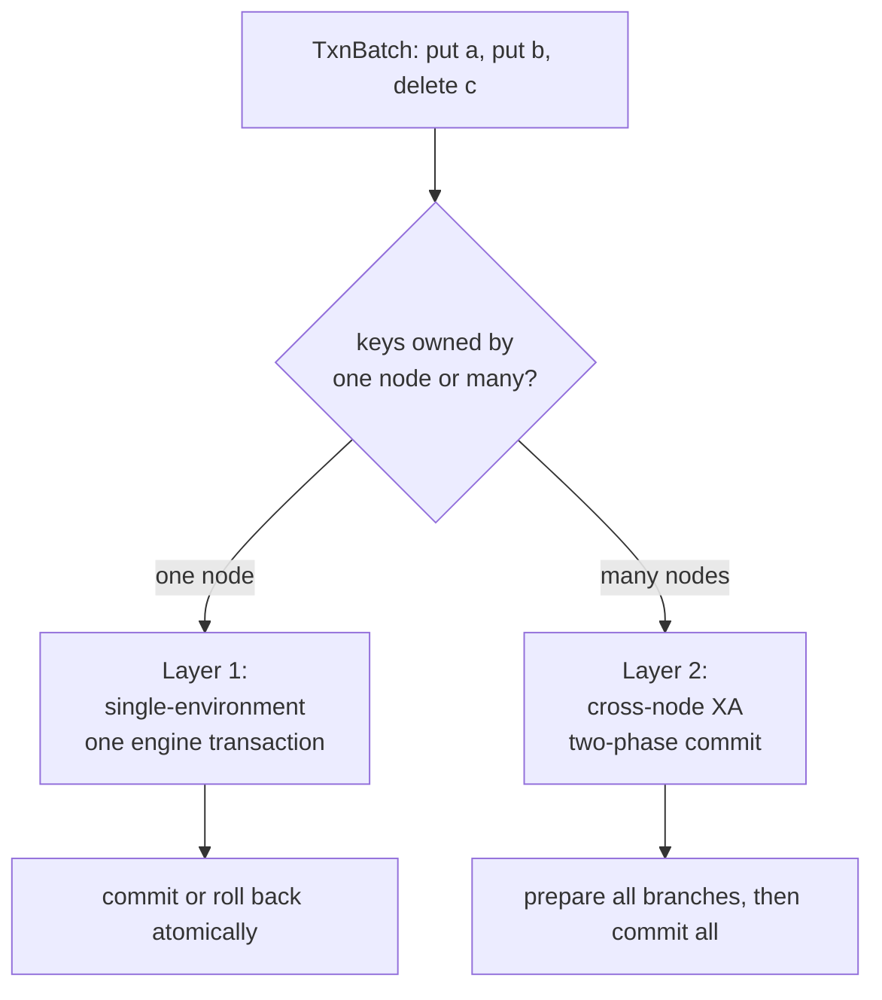
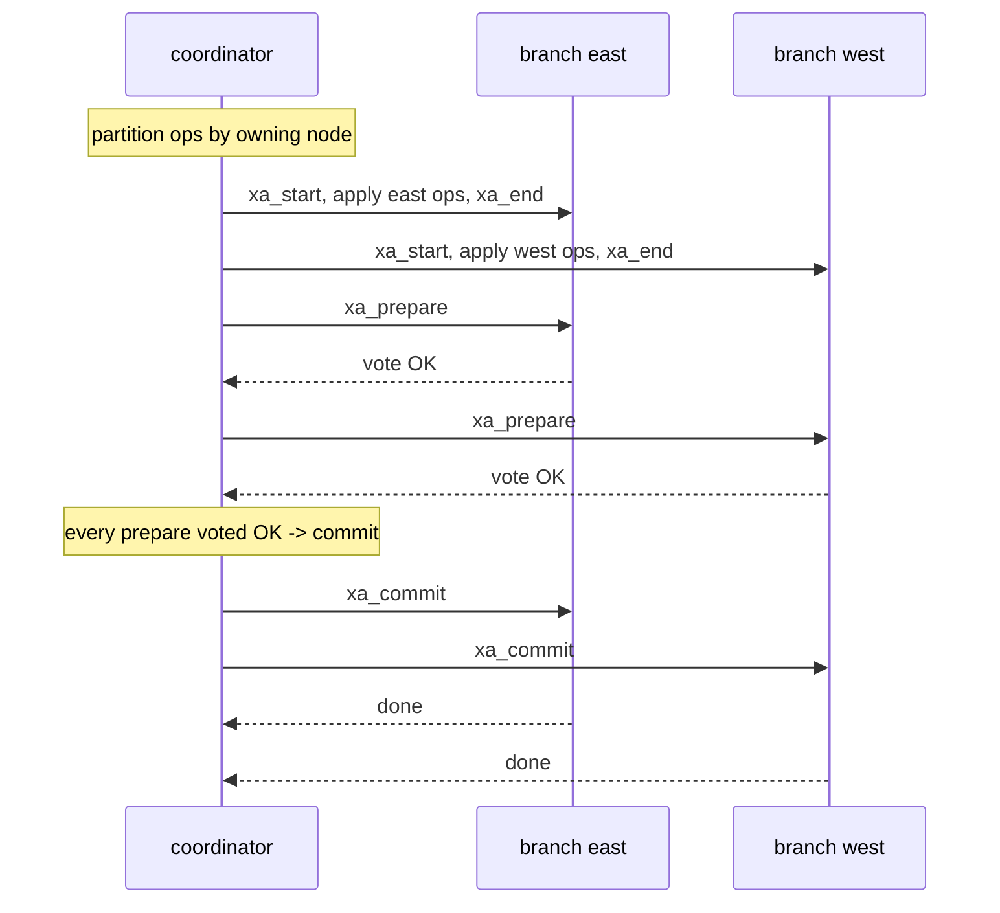
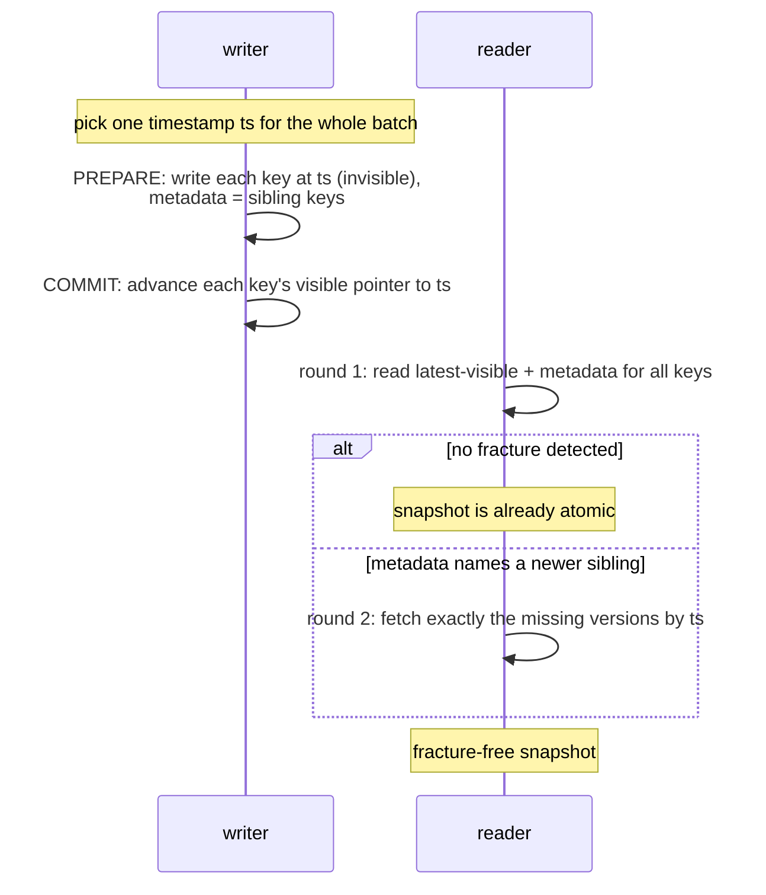

# Distributed Transactions (XA / 2PC)

CRDTs make a single key converge without coordination. But some updates
must span *several* keys and be all-or-nothing: move a balance from one
account object to another, or write an object and its index entry
together so a reader never sees one without the other. Riak's per-key
model had no answer for that -- a multi-key atomic write in Riak would
have needed a consensus layer it did not ship. Dyniak adds one, built on
the transactional Noxu engine underneath it.

This chapter covers the two transaction paths Dyniak offers: the
heavyweight two-phase commit (XA) path for full atomicity across nodes,
and the lighter read-atomic (RAMP) path for the common "see all of a
batch or none of it" case without blocking.

## The two layers

A multi-key transaction stacks in two layers, and which one runs depends
on where the keys live:


<p class="dyn-caption">A batch whose keys all land on one node commits
in a single Noxu engine transaction. A batch that spans nodes is
coordinated with X/Open XA two-phase commit over the DNODE peer
plane.</p>

<dl class="dyn-facts">
<dt>Layer 1: single-environment</dt>
<dd>Every op in the batch routes to one node's Noxu environment and
commits inside one engine transaction. Simple, fast, fully atomic.</dd>
<dt>Layer 2: cross-node XA</dt>
<dd>The batch touches keys owned by different primary nodes. Each node
prepares its branch; the coordinator commits every branch only once
every prepare has voted to commit. This is X/Open two-phase commit.</dd>
</dl>

The client does not choose a layer. It submits a batch; the coordinator
partitions the ops by owning node and picks the cheapest correct path.

## Submitting a transaction

Over HTTP, a transaction is a JSON batch to `POST /transactions`
(cluster-wide) or `POST /buckets/{bucket}/transactions` (bucket-scoped,
where every op must target the URL's bucket):

```sh
curl -s -X POST http://127.0.0.1:8098/transactions \
  -H 'Content-Type: application/json' \
  -d '{
    "operations": [
      {"op": "put", "bucket": "accounts", "key": "alice",
       "value": "balance=90",
       "indexes": [{"name": "owner_bin", "value": "alice"}]},
      {"op": "put", "bucket": "accounts", "key": "bob",
       "value": "balance=110"},
      {"op": "delete", "bucket": "pending", "key": "xfer-7"}
    ]
  }'
```

A committed batch replies `200 OK`:

```json
{"result": "committed", "operations": 3}
```

The ops are replayed in order inside the transaction. A `put` carries an
optional list of 2i entries, fanned into the secondary-index layer as
part of the same atomic unit, so the object and its index land together
or not at all.

```admonish note title="JSON values are UTF-8; use PBC for binary"
The JSON transaction endpoint carries values and index values as UTF-8
strings. Arbitrary binary payloads are not representable through JSON;
the PBC transaction extension carries raw bytes. This is the same
limitation the object endpoints have when you choose JSON encoding.
```

### The abort path

A batch with `"abort": true` applies every op inside the transaction and
then deliberately rolls back, leaving the keyspace untouched. It exists
so clients and tests can exercise the rollback path deterministically:

```sh
curl -s -X POST http://127.0.0.1:8098/transactions \
  -H 'Content-Type: application/json' \
  -d '{"abort": true, "operations": [
        {"op": "put", "bucket": "b", "key": "k", "value": "v"}]}'
```

```json
{"result": "aborted", "reason": "client requested abort"}
```

A batch that the engine rolls back because of a serialization conflict
replies `409 Conflict`; the client may retry. A datastore that is not
transactional (any backend other than the Noxu-backed one) replies
`501 Not Implemented`.

## The two-phase commit protocol

When a batch spans nodes, the coordinator runs X/Open XA. Each node is
one *resource manager* backed by its own Noxu environment; the
coordinator is the *transaction manager*.


<p class="dyn-caption">Two-phase commit across two branches. Work is
applied and each branch is prepared; only after every branch votes to
commit does the coordinator issue the commits. A single "no" vote (or a
force-abort) rolls back every prepared branch.</p>

Three details make this robust against the network failure modes a
single-process commit never sees:

* **Read-only optimization.** A branch that performed no writes votes
  read-only on prepare and skips the second phase entirely -- no commit
  round for a branch that changed nothing.
* **Presumed abort.** If a prepare fails or times out, the coordinator
  presumes abort and rolls back every branch already prepared. No branch
  is left holding a prepared-but-undecided transaction.
* **Commit-in-doubt recovery.** A branch that voted to commit is
  recorded in a durable in-doubt log. If the coordinator crashes after
  the commit decision but before every branch confirmed, a cold restart
  re-reads the log and forward-recovers each in-doubt branch, so a
  branch that voted to commit is never left dangling.

The local-branch machinery (`XaParticipant`, one per node) is shared
verbatim between the in-process coordinator and the cross-node
coordinator; only the transport differs. The cross-node coordinator
drives the identical prepare-then-commit phases over the DNODE peer
plane described in [Dyniak wire protocols](../protocols/dyniak.md).

```admonish note title="Road not taken: 2PC, not Paxos or Raft, for cross-node transactions"
Two-phase commit is famously blocking: if the coordinator fails at the
wrong instant, a prepared branch can be stuck until recovery runs.
Consensus protocols like Paxos or Raft are non-blocking under the same
failure. So why 2PC?

First, the failure window is narrow and Dyniak closes it with the
durable in-doubt log and automatic cold-restart recovery above -- a
branch that voted to commit always reaches a decision. Second, Dyniak's
whole design bet is *distribution as a thin layer over a transactional
storage engine*: Noxu already implements XA branches with a durable
prepared-transaction log, so 2PC is a thin coordinator over machinery
that exists, whereas a per-transaction consensus group would be a large
new subsystem duplicating what Noxu already guarantees locally. Third, a
Raft-per-key or Raft-per-transaction design is exactly the
strong-consistency subsystem Dyniak deliberately leaves out of scope
(Riak's `riak_ensemble`); adopting it for transactions would drag the
whole store toward a consistency model it does not promise. The full
argument is in [Roads Not Taken](../reference/roads-not-taken.md).
```

## The read-atomic path (RAMP)

Full 2PC is the right tool when you need serializable atomicity, but it
is heavy: it blocks, it coordinates, it commits in two rounds. For the
very common case of "read several keys and see a consistent snapshot, or
write several keys so no reader ever sees a partial batch," Dyniak
offers a lighter path: RAMP-Fast (Bailis et al., SIGMOD 2014).

RAMP guarantees *read-atomic isolation*: a transaction sees all of
another transaction's writes or none of them -- never a *fractured
read* where you observe transaction `T`'s write to key `a` but miss its
write to key `b`. Crucially, a reader never blocks on a writer.


<p class="dyn-caption">RAMP-Fast. Writes are two-phase but non-blocking:
prepare writes invisible versions, commit advances the visible pointers.
Reads take one round plus a conditional second round only when the
first round detects a fracture. In the contention-free case the second
round is skipped.</p>

A RAMP write picks one monotonic timestamp for the whole batch, writes
every key as an invisible versioned record carrying the set of sibling
keys, then advances each key's visible pointer. A RAMP read fetches the
latest visible version plus metadata for every key; if any version's
metadata names a sibling the reader saw at an older version, round 2
fetches exactly those missing versions -- which prepare guarantees are
present -- and the repaired snapshot is fracture-free.

Over HTTP:

```sh
# atomic multi-key write
curl -s -X POST http://127.0.0.1:8098/ramp/transactions \
  -H 'Content-Type: application/json' \
  -d '{"writes": [{"bucket": "b", "key": "a", "value": "1"},
                  {"bucket": "b", "key": "b", "value": "2"}]}'
# {"result":"committed","ts":<timestamp>,"keys":2}

# atomic multi-key read (fracture-free snapshot)
curl -s -X POST http://127.0.0.1:8098/ramp/read \
  -H 'Content-Type: application/json' \
  -d '{"keys": [{"bucket": "b", "key": "a"}, {"bucket": "b", "key": "b"}]}'
# {"snapshot": {"a": "1", "b": "2"}, "rounds": 1}
```

The response reports `rounds` (1 or 2) so you can see when the read hit
contention.

## XA versus RAMP: which to use

<dl class="dyn-facts">
<dt>Use XA / 2PC when</dt>
<dd>You need full atomicity with the possibility of rollback on
conflict -- move money, enforce an invariant across keys, write an
object and its index as one unit that can fail cleanly.</dd>
<dt>Use RAMP when</dt>
<dd>You need a consistent multi-key snapshot or an all-or-nothing
multi-key write, but you do not need to abort on conflict and you want
readers never to block. Lower latency, availability-native.</dd>
<dt>Use a single CRDT when</dt>
<dd>The update is confined to one key. No transaction needed -- the
merge is automatic. See <a href="./crdts.md">Convergent Data Types</a>.</dd>
</dl>

## Where to next

* [Convergent Data Types](./crdts.md) -- the coordination-free
  single-key alternative.
* [Anti-Entropy and Repair](./aae.md) -- how the substrate reconciles
  divergence outside the transaction path.
* [Dyniak features ops](../operations/dyniak-features.md) -- operator
  view of cross-node transactions.
* [Consistency](../architecture/consistency.md) -- the underlying
  replication and quorum model.
