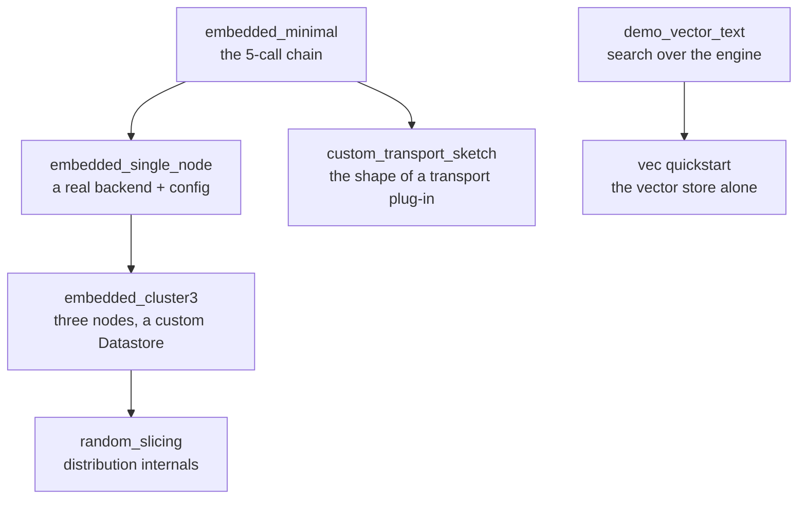

# Reading the Examples

The programs under [`crates/*/examples/`](https://codeberg.org/gregburd/dynomite/src/branch/main/crates)
are complete, compilable, runnable code -- not the illustrative snippets
scattered through the rest of this manual. Each one is a focused study of
one facet of the engine, and each has a page here that explains what it
demonstrates, the design decisions it embodies, the trade-offs behind
those decisions, and when you would reach for the pattern it shows.

```admonish tip title="Run any example"
Every example runs from a `nix develop` shell with:

    cargo run -p <crate> --example <name>

The per-example pages give the exact command and the expected output.
```

## The learning path

The examples are ordered here from smallest to most involved. If you are
new to embedding Dynomite, read them in this order; each builds on the
call chain the previous one introduced.


<p class="dyn-caption">The example programs, arranged from the smallest
runnable engine to the distribution internals and the search stack.</p>

## Index

| Example | Crate | What it teaches |
|---|---|---|
| [`embedded_minimal`](./embedded_minimal.md) | `dynomite` | The smallest runnable embedded engine: the build/start/shutdown handshake. |
| [`embedded_single_node`](./embedded_single_node.md) | `dynomite` | A one-node engine in front of a real Valkey, with explicit configuration. |
| [`embedded_cluster3`](./embedded_cluster3.md) | `dynomite` | Three in-process nodes sharing a custom `Datastore` hook. |
| [`random_slicing`](./random_slicing.md) | `dynomite` | The random-slicing distribution mode and per-peer ownership. |
| [`embedded_custom_transport_sketch`](./custom_transport.md) | `dynomite` | The shape (not a runnable plug-in) of a custom transport. |
| [`demo_vector_text`](./demo_vector_text.md) | `dynomite-search` | Vector, trigram-text, and combined search over the engine. |
| [`quickstart`](./vec_quickstart.md) | `dynomite-vec` | The vector store on its own, over HTTP. |

```admonish note title="Examples versus snippets"
When this manual writes "example" in a getting-started or reference
chapter, it usually means an *inline teaching snippet* -- a few lines to
make a point. The word means these standalone programs only in this part
of the book. The distinction matters because the snippets are chosen for
clarity and may omit error handling or setup that a real program needs;
the programs here are complete.
```
