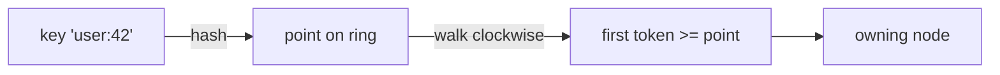
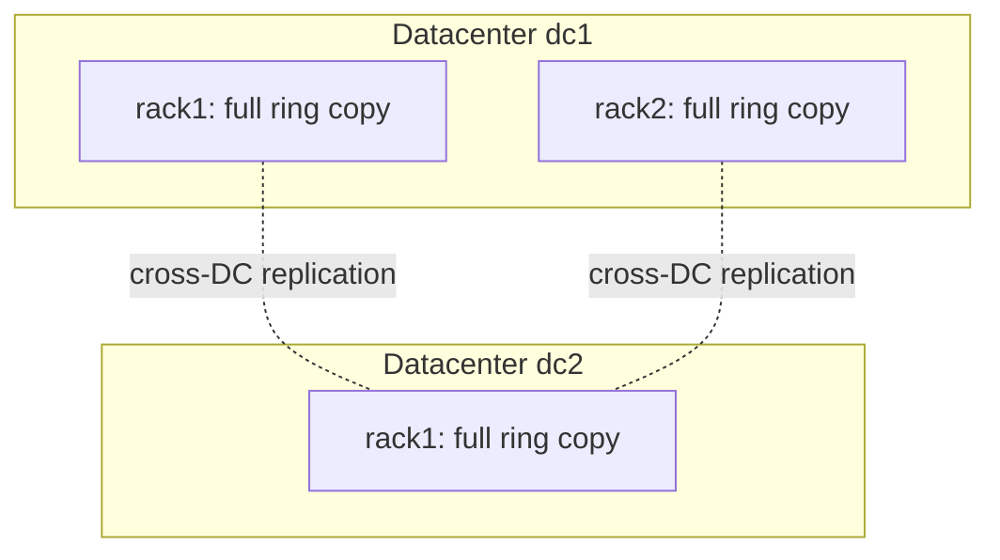
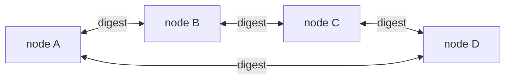
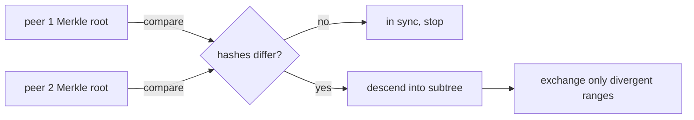
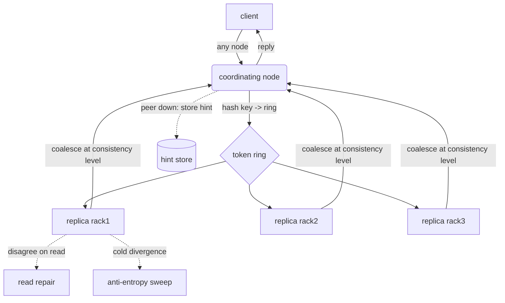

# Concepts in Ten Minutes

This chapter is the shared vocabulary. Every later page assumes you
know these terms, so it is worth ten minutes now to save an hour later.
Each concept gets a tight definition, a sentence on why it exists, and a
link to the chapter that treats it in full. Read it top to bottom the
first time; come back to it as a glossary afterward.

The mental model is a chain. A **key** hashes to a point on a **ring**.
The ring is owned by **nodes**, grouped into **racks**, grouped into
**datacenters**. A write lands on several **replicas**; how many must
agree is the **consistency level**. Nodes learn each other's health
through **gossip**. When a replica is briefly unreachable, **hinted
handoff** holds its writes; when replicas drift apart, **read repair**
and **anti-entropy** pull them back together. That chain is the whole
system.

## The token ring

Dynomite partitions the key space with **consistent hashing**. Imagine
the output of the hash function laid out on a circle -- the **token
ring**. Every node claims one or more **tokens**, which are just
positions on that circle. To place a key, hash it to a point and walk
clockwise to the first token; the node that owns that token owns the
key.


<p class="dyn-caption">A key is placed by hashing it to a point and
walking the ring clockwise to the first token. The owner of that token
owns the key.</p>

Consistent hashing is the reason adding or removing a node only reshuffles
the keys near that node's tokens, not the entire key space. The full
treatment -- token arithmetic, the continuum, and how replicas are
chosen by continuing the walk -- is in
[The Ring and the Token Space](../architecture/ring.md).

```admonish note title="Road not taken"
Dynomite hashes keys to fixed token positions rather than hashing to a
consensus-elected shard leader. There is no leader per shard and no
central placement service. That is the availability-first choice; its
consequences (no single ordering point) are discussed in
[Replication and Consistency](../architecture/consistency.md) and
[Roads Not Taken](../reference/roads-not-taken.md).
```

## Node, rack, datacenter

These three form the physical hierarchy, and replication is aware of all
three levels.

<dl class="dyn-facts">
<dt>Node</dt>
<dd>One <code>dynomited</code> process (or one embedded
<code>Server</code>) fronting one backend datastore. Nodes are
symmetric -- there is no special coordinator node. A client may connect
to any node.</dd>
<dt>Rack</dt>
<dd>A named group of nodes that, together, hold a <em>complete copy</em>
of the datacenter's key space. A rack is a replica set: each rack covers
the whole ring exactly once. Racks usually map to failure domains
(a physical rack, an availability zone).</dd>
<dt>Datacenter (DC)</dt>
<dd>A named group of racks. Multiple racks in one DC means multiple
local copies; multiple DCs means geographic replication. Consistency
levels are expressed relative to the DC (hence the <code>DC_</code>
prefix).</dd>
</dl>

The key invariant: **one rack = one full copy of the ring**. If a
datacenter has three racks, the DC holds three copies of every key, one
per rack. That is how the number of replicas is controlled -- by how
many racks you deploy, not by a per-key setting. See
[The Ring and the Token Space](../architecture/ring.md) for how the
per-rack continuum is built.


<p class="dyn-caption">Two racks in dc1 hold two local copies; dc2 holds
a third across the wire. Replica count is a function of how many racks
exist, not a per-key knob.</p>

## Replica

A **replica** is a copy of a key held on a distinct rack. Because each
rack covers the whole ring, the replicas of a key are "the node owning
that key's token, in each rack." A read or write fans out to the
replicas that the consistency level requires, and their answers are
**coalesced** into the single reply the client sees. When replicas
disagree, reconciliation kicks in (read repair, below).

## Consistency level

The **consistency level** is the knob that trades latency against
overlap. It says how many replicas must acknowledge before Dynomite
answers the client. It is set per pool, and can be overridden per
request class through [bucket types](../configuration.md). There are
four, and they apply independently to reads (`read_consistency`) and
writes (`write_consistency`):

| Level | Meaning |
| --- | --- |
| `DC_ONE` | One replica in the local DC answers. Lowest latency, weakest overlap. Good for caches. |
| `DC_QUORUM` | A majority of the local DC's replicas must agree. |
| `DC_SAFE_QUORUM` | A quorum that additionally accounts for peer health / token ownership, rejecting when a safe quorum cannot be formed. |
| `DC_EACH_SAFE_QUORUM` | A safe quorum in **every** datacenter, not just the local one. Strongest overlap, highest latency, cross-DC fan-out. |

```admonish warning title="Quorum is overlap, not linearizability"
Even `DC_EACH_SAFE_QUORUM` gives you read/write quorum *overlap* in the
Dynamo tradition -- enough replicas agree that a read is likely to see a
recent write. It does **not** give you a single global order for writes.
Concurrent writes to one plain key reconcile last-writer-wins. If you
need conflict-free merges, use the
[Dyniak CRDT layer](../dyniak/crdts.md).
```

In the embedded API these are the `ConsistencyLevel` variants
(`DcOne`, `DcQuorum`, `DcSafeQuorum`, `DcEachSafeQuorum`); in YAML they
are the `DC_ONE` / `DC_QUORUM` / `DC_SAFE_QUORUM` / `DC_EACH_SAFE_QUORUM`
strings shown above. The full semantics -- how a quorum is counted, how
answers are coalesced, what happens when it cannot be met -- are in
[Replication and Consistency](../architecture/consistency.md).

## Gossip

Nodes do not have a central registry telling them who is alive. Instead
they **gossip**: on a fixed interval, each node exchanges a small digest
of what it knows about every peer's state and token assignment with a
few others. Over a handful of rounds, a change (a node joined, a node
went quiet) propagates to the whole cluster. Gossip is what turns a list
of seed addresses into a live, self-healing membership view.


<p class="dyn-caption">Each round, a node swaps state digests with a few
peers. A membership change reaches everyone in a few rounds without any
central coordinator.</p>

From gossip come two operational behaviors: a peer that stops responding
is marked down and **auto-ejected** from routing, and when it comes back
it **auto-rejoins**. The state machine, the digest format, and the
failure detector live in
[Membership and Gossip](../architecture/gossip.md).

## Hinted handoff

A write's target replica might be down for a moment -- a restart, a
brief network blip. Dropping the write would weaken durability;
blocking on it would hurt availability. **Hinted handoff** takes the
third path: the coordinating node stores the write locally as a *hint*
tagged with the intended peer, keeps serving, and a background drainer
**replays** the hint once gossip reports the peer back to `Normal`.

Hinted handoff is **off by default** and applies to writes only. Turn it
on and size its store, TTL, and drain cadence per pool -- the knobs
(`enable_hinted_handoff`, `hint_ttl_seconds`, `hint_store_max_bytes`,
`hint_drain_interval_ms`, `hint_dir`) are documented under
[Configuration](../configuration.md#hinted-handoff). Failure behavior in
full is in [Failure Handling](../architecture/failure.md).

## Read repair

Replicas drift. A hint has not drained yet; a write missed a replica
that was briefly down. **Read repair** fixes the divergence on the read
path: when a read fans out to several replicas and their answers
disagree, Dynomite returns the freshest to the client and, in the
background, writes it back to the stale replicas. It is opportunistic --
it only repairs the keys that are actually read -- and cheap, which is
why it is the first line of reconciliation. Read repair applies to
`GET`-style reads. See [Failure Handling](../architecture/failure.md).

## Anti-entropy

Read repair only heals keys that get read. Cold keys can stay divergent
indefinitely. **Active anti-entropy (AAE)** is the background sweep that
closes that gap: peers exchange **Merkle trees** (compact hashes of key
ranges), spot the ranges whose hashes differ, and reconcile only those
ranges -- without shipping the whole dataset. It is the slow, thorough
backstop behind the fast, opportunistic read repair.


<p class="dyn-caption">Merkle-tree comparison narrows reconciliation to
just the divergent key ranges, so anti-entropy scales with the drift,
not the dataset.</p>

For plain RESP/Memcache pools AAE is the reconciliation backstop; the
richer, scheduled AAE (full sweeps, segment ticks, per-bucket trees)
belongs to [Dyniak](../dyniak/aae.md) and is configured under the
`riak:` block. See [Failure Handling](../architecture/failure.md) for
how the pieces fit.

## How it all fits


<p class="dyn-caption">The full request path: hash to the ring, fan out
to replicas, coalesce at the consistency level, and reconcile via hinted
handoff, read repair, and anti-entropy when things go wrong.</p>

With the vocabulary in hand, pick your path:

* Running the server: [Your First Cluster](./first-cluster.md).
* Embedding the library: [Your First Embedded Engine](./first-embed.md).
* The deep dives: [Architecture](../architecture.md) and its subpages
  on [the ring](../architecture/ring.md),
  [consistency](../architecture/consistency.md),
  [gossip](../architecture/gossip.md), and
  [failure handling](../architecture/failure.md).
