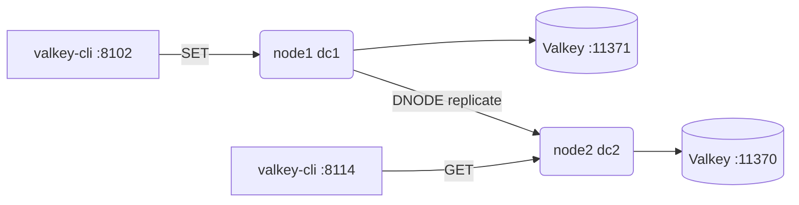

# Your First Cluster

This chapter takes you from a fresh checkout to a running two-node
Dynomite cluster fronting Valkey, and then proves the point of the whole
project: a value written through one node is readable through the other.
Everything here uses `dynomited`, the server binary. If you want the
library instead, see
[Your First Embedded Engine](./first-embed.md).

We build a **two-datacenter** cluster: one node in `dc1`, one in `dc2`,
each fronting its own local Valkey. The two nodes share a token, so each
is a full replica of the other -- which is exactly what makes the
cross-node read at the end work. This is the shape of the shipped
`node1.yml` / `node2.yml` sample pair, and you can start from those
files directly.

```admonish tip title="Prerequisites"
Run everything inside `nix develop`. The flake pins `dynomited`,
`valkey-server`, `valkey-cli` (via the `redis` package), and every tool
below. Nothing here needs root.
```

## Step 1: enter the dev shell

```console
$ cd dynomite
$ nix develop
```

You now have `valkey-server`, `valkey-cli`, and a way to run
`dynomited` (`cargo run -p dynomited -- ...`) on your `PATH`.

## Step 2: start two backends

Each node fronts its **own** backend. This is the single most common
first-time mistake, so it gets an admonition:

```admonish warning title="One backend per node"
Do not point two dynomited nodes at the same Valkey. If they share a
backend, replication is an illusion -- both "replicas" are the same
bytes, and a partition test proves nothing. Give every node a distinct
backend (a distinct port here, distinct hosts in production).
```

Start two Valkey instances on distinct ports:

```console
$ valkey-server --port 11371 --daemonize yes
$ valkey-server --port 11370 --daemonize yes
```

Sanity-check them:

```console
$ valkey-cli -p 11371 ping
PONG
$ valkey-cli -p 11370 ping
PONG
```

## Step 3: write the node configs

A `dynomited` config is one YAML pool stanza. Here is `node1.yml`, in
`dc1`, fronting the Valkey on `11371`:

```yaml
dyn_o_mite:
    datacenter: dc1
    rack: rack1
    listen: 127.0.0.1:8102
    dyn_listen: 127.0.0.1:8101
    dyn_seeds:
        - 127.0.0.1:8113:rack1:dc2:101134286
    dyn_seed_provider: simple_provider
    tokens: '101134286'
    servers:
        - 127.0.0.1:11371:1
    data_store: 0
    stats_listen: 127.0.0.1:33331
    preconnect: true
```

And `node2.yml`, in `dc2`, fronting the Valkey on `11370`:

```yaml
dyn_o_mite:
    datacenter: dc2
    rack: rack1
    listen: 127.0.0.1:8114
    dyn_listen: 127.0.0.1:8113
    dyn_seeds:
        - 127.0.0.1:8101:rack1:dc1:101134286
    dyn_seed_provider: simple_provider
    tokens: '101134286'
    servers:
        - 127.0.0.1:11370:1
    data_store: 0
    stats_listen: 127.0.0.1:33333
    preconnect: true
```

These are the shipped samples under `crates/dynomited/conf/`
(`node1.yml`, `node2.yml`); you can copy them verbatim.

### What each knob does

The pool key (`dyn_o_mite`) is just the pool name; it can be anything.
Inside it:

<dl class="dyn-facts">
<dt>datacenter / rack</dt>
<dd>Where this node sits in the physical hierarchy from
<a href="./concepts.md">Concepts</a>. One rack per DC here means one
full copy of the ring per DC -- so the two nodes are replicas of each
other across the two DCs.</dd>
<dt>listen</dt>
<dd>The <em>client plane</em>: the address your Valkey clients connect
to. Node 1 serves clients on <code>8102</code>, node 2 on
<code>8114</code>. Clients speak plain RESP here.</dd>
<dt>dyn_listen</dt>
<dd>The <em>peer plane</em>: the address other dynomited nodes connect
to for gossip and replication (the DNODE protocol). Node 1 listens on
<code>8101</code>, node 2 on <code>8113</code>. Clients never touch
this port.</dd>
<dt>dyn_seeds</dt>
<dd>The bootstrap peer list: <code>host:dyn_port:rack:dc:token</code>.
Node 1 seeds node 2's peer address and vice versa. Once gossip
converges, the full membership is learned from these seeds.</dd>
<dt>tokens</dt>
<dd>This node's position(s) on the ring. Both nodes claim the same token
(<code>101134286</code>), so each owns the same slice in its own rack --
i.e. they are replicas. Different tokens would make them shard partners
instead.</dd>
<dt>servers</dt>
<dd>The backend datastore: <code>host:port:weight [name]</code>. Node 1
fronts Valkey on <code>11371</code>, node 2 on <code>11370</code> --
distinct backends, per the warning above.</dd>
<dt>data_store</dt>
<dd><code>0</code> selects the Valkey / RESP backend (alias
<code>valkey</code>/<code>redis</code>). <code>1</code> is Memcache,
<code>2</code> is Dyniak. See the
<a href="../reference/man-pages.md">dynomited(8)</a> backend list.</dd>
<dt>stats_listen</dt>
<dd>The HTTP stats endpoint for this node. Distinct per node so both can
run on one host.</dd>
<dt>preconnect</dt>
<dd>Open the backend connection at startup rather than on first request,
so a misconfigured backend fails loudly and early.</dd>
</dl>

The exhaustive field list, plus consistency levels, bucket types, and
hinted handoff, is in [Configuration](../configuration.md).

## Step 4: validate before you launch

Always dry-run the config first. The `--test-conf` flag parses and
validates, then exits without binding anything:

```console
$ cargo run -p dynomited -- --test-conf --conf-file node1.yml
$ cargo run -p dynomited -- --test-conf --conf-file node2.yml
```

A clean exit means the YAML is well-formed and internally consistent (no
duplicate bucket-type names, valid consistency strings, resolvable
listen addresses, and so on). Fix anything it reports before moving on.

## Step 5: launch both nodes

In two terminals (both inside `nix develop`):

```console
$ cargo run -p dynomited -- --conf-file node1.yml
```

```console
$ cargo run -p dynomited -- --conf-file node2.yml
```

Each logs its bound client and peer addresses and then a gossip round as
the two discover each other. Give it a second or two to converge.

```admonish note title="Wildcard binds need an advertised address"
The shipped samples bind <code>127.0.0.1</code> so the two nodes find
each other on one host. If you bind a wildcard such as
<code>0.0.0.0:8101</code> for <code>dyn_listen</code> in a real
deployment, a peer cannot gossip to "all interfaces" -- it needs a
concrete, reachable address to dial. Bind and advertise a specific
routable address per node, not a wildcard, on the peer plane.
```

## Step 6: write to one node, read from the other

This is the payoff. Set a key through node 1's client port
(`8102`):

```console
$ valkey-cli -p 8102 set greeting "hello from dc1"
OK
```

Now read it through node 2's client port (`8114`) -- a different node,
in a different datacenter, fronting a different backend:

```console
$ valkey-cli -p 8114 get greeting
"hello from dc1"
```

The value crossed the cluster. Node 1 coordinated the write, routed it
over the ring, and replicated it to node 2's replica over the peer
plane; node 2 served the read from its own backend. The client did none
of that -- it spoke plain RESP to whichever node was nearest.

You can confirm the two backends really do each hold a copy:

```console
$ valkey-cli -p 11371 get greeting
"hello from dc1"
$ valkey-cli -p 11370 get greeting
"hello from dc1"
```

Two distinct Valkey instances, same value -- that is replication, not a
shared backend.

## Step 7: watch the stats

Each node exposes an HTTP stats endpoint on its `stats_listen` address:

```console
$ curl -s http://127.0.0.1:33331/ | head
$ curl -s http://127.0.0.1:33333/ | head
```

You will see per-pool and per-server counters -- request rates, forward
counts, peer states. These are the same metrics the
[Metrics](../operations/metrics.md) chapter describes, and the fields
are enumerated by `dynomited --describe-stats`.

## What just happened


<p class="dyn-caption">A write on node 1 replicated across the peer
plane to node 2; a read on node 2 served the replicated value from its
own backend.</p>

You built a shared-nothing, cross-DC replicated cluster in front of an
unmodified Valkey, and your client never learned the topology. That is
the Dynomite bet from [Why Dynomite?](./why.md) made concrete.

## Where to next

* Turn consistency up: set `read_consistency` / `write_consistency` in
  the pool stanza and re-run. Start with `DC_ONE` (what these samples
  use by default) and move to `DC_QUORUM`. See
  [Configuration](../configuration.md) and
  [Replication and Consistency](../architecture/consistency.md).
* Add a third node in a second rack of `dc1` for a local replica; the
  shipped `redis_rack1_node.yml` / `redis_rack2_node.yml` /
  `redis_rack3_node.yml` samples show a three-rack single-DC layout with
  `DC_SAFE_QUORUM` already configured.
* Break something on purpose: stop one node and watch gossip eject it,
  then restart it and watch it rejoin. The mechanics are in
  [Membership and Gossip](../architecture/gossip.md) and
  [Failure Handling](../architecture/failure.md).
* Front a different backend: set `data_store: 1` and point `servers` at
  a `memcached` instance from the flake.
* For the operator's view -- daemonizing, log formats, pid files, admin
  operations -- read [`dynomited(8)`](../reference/man-pages.md) and
  [Running dynomited](../operations/running.md).
