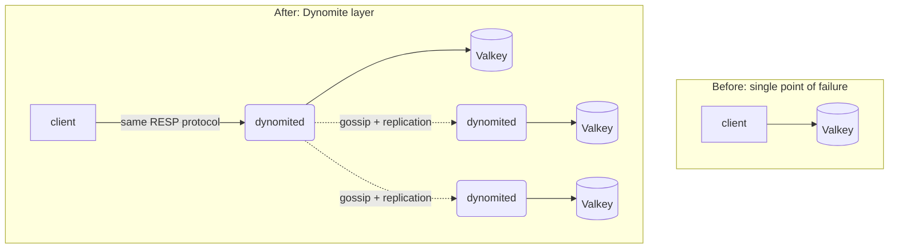

# Why Dynomite?

<div class="dyn-hero">
<span class="dyn-tagline">You already have a fast single-node store.
Dynomite makes it a cluster without asking it to change.</span>

Valkey and Memcached are excellent at what they do -- serve a key
space from one process, at very low latency. What they do not do is
replicate that key space across racks and datacenters, survive the
loss of a node without operator intervention, or reconcile divergent
copies after a partition. Dynomite adds exactly those properties as a
layer in front of the store you already run.
</div>

This page is the "should I use this at all" chapter. It states the
problem Dynomite solves, the bet it makes to solve it, the things it
deliberately does **not** do, and how it compares to the obvious
alternatives. Read it before you commit to the design; the trade-offs
here shape every later choice.

## The problem

A single-node key/value store is a single point of failure. When the
process dies, the machine reboots, the rack loses power, or the
datacenter goes dark, the data it held is unavailable until something
brings it back. For a cache that is an annoyance; for a session store
or a shopping cart it is an outage.

The usual answers each have a cost:

* **Replicate inside the store.** Redis replication and Redis Cluster
  bolt replication and sharding onto the store itself. That works, but
  it couples your availability story to one vendor's clustering model,
  and it does not help the Memcached deployment two teams over.
* **Put a proxy in front.** A proxy such as `twemproxy` shards across
  backends, but a classic proxy has no notion of replicas, no gossip,
  no failure detection, and no reconciliation. It spreads load; it does
  not make you highly available.
* **Move to a distributed database.** Cassandra, ScyllaDB, DynamoDB,
  and friends are distributed from the ground up. If you want their
  data model and are willing to migrate to it, that is a fine answer --
  but it is a rewrite, not a layer, and you give up the exact
  single-node store you already tuned and trust.

## The Dynomite bet

Dynomite -- following the
[Amazon Dynamo paper](http://www.allthingsdistributed.com/files/amazon-dynamo-sosp2007.pdf)
and Netflix's original C implementation -- makes one central bet:

> Availability, sharding, and cross-datacenter replication can be added
> as a **thin layer in front of** a storage engine, rather than baked
> **into** it.

The store stays simple and fast. Dynomite wraps it with the
distributed-systems machinery -- a consistent-hash token ring, gossip
membership, tunable quorum, hinted handoff, read repair, and anti-entropy
-- and the two concerns stay cleanly separated. Your clients keep
speaking the store's own wire protocol; they never learn the topology.


<p class="dyn-caption">The client's contract does not change. It speaks
the backend's protocol to any node; Dynomite handles routing,
replication, and recovery behind that unchanged wire.</p>

The payoff of the bet is separation of concerns. The store team keeps
optimizing single-node throughput; the distribution layer evolves on its
own schedule; and a Memcached shop and a Valkey shop get the same
availability story from the same binary.

```admonish note title="Road not taken"
The alternative to a layer is to fork the store and teach it to
replicate -- which is what Redis Cluster is. Dynomite deliberately did
not do that. Coupling distribution to one store's internals is exactly
the coupling the layer exists to avoid. See
[Design Decisions (Roads Not Taken)](../reference/roads-not-taken.md).
```

## What Dynomite is not

Being explicit about the ceiling matters more than the pitch. Dynomite
is a Dynamo-style, **availability-first** system. That has hard
consequences you must accept going in:

<dl class="dyn-facts">
<dt>Not a consensus system</dt>
<dd>There is no RAFT, no Paxos, no single leader ordering writes.
Dynomite does not give you linearizable, strictly-serializable writes on
plain key/value operations. If you need "the write either happened
everywhere in one order or nowhere", this is not that tool for that key
class.</dd>
<dt>Tunable, not strong, by default</dt>
<dd>Consistency is a knob per read and per write:
<code>DC_ONE</code>, <code>DC_QUORUM</code>,
<code>DC_SAFE_QUORUM</code>, <code>DC_EACH_SAFE_QUORUM</code>. You trade
latency for overlap. Even at quorum this is the Dynamo tradition of
eventual consistency with quorum overlap, not a linearizability
guarantee. See
<a href="../architecture/consistency.md">Replication and
Consistency</a>.</dd>
<dt>Last-write-wins on plain keys</dt>
<dd>Concurrent writes to the same plain key reconcile by last-writer-wins.
If you need conflict-free merges you want the
<a href="../dyniak/crdts.md">Dyniak CRDT layer</a>, not raw RESP.</dd>
<dt>Not a query engine on the RESP path</dt>
<dd>The RESP and Memcache surfaces are the backend's own commands. Rich
queries, secondary indexes, MapReduce, and full-text/vector search live
in <a href="../dyniak/index.md">Dyniak</a>, the optional Riak-compatible
layer.</dd>
</dl>

If any of those constraints is a dealbreaker for your workload, stop
here and reach for a consensus store. If they are acceptable -- and for
caches, sessions, feature flags, counters, and most "mostly-available
beats occasionally-perfect" data they are -- read on.

## When to reach for Dynomite (and when not)

| You want... | Reach for |
| --- | --- |
| HA + cross-DC replication over an existing Valkey / Memcached, clients unchanged | **Dynomite** |
| Sharding + replication and you are happy to adopt one vendor's clustering | Redis Cluster / Valkey native clustering |
| Pure sharding, no replicas, no failure handling | a classic proxy (`twemproxy`) |
| Linearizable writes, single-key CAS you can bet money on | a consensus store (etcd, a RAFT KV, a SQL DB) |
| A distributed database with a rich data model | Cassandra, ScyllaDB, DynamoDB |
| Riak-style buckets, CRDTs, 2i, MapReduce, search on top of the ring | **Dynomite + [Dyniak](../dyniak/index.md)** |

Two comparisons deserve a closer look because they are the ones people
actually agonize over.

**Dynomite vs Redis Cluster / Valkey native clustering.** Both give you
sharding and replicas. The native clustering is tighter with the store
and needs no extra process. Dynomite's edge is that it is
store-agnostic (the same layer fronts Memcached), it is topology-opaque
to clients (a plain Redis client works, no cluster-aware client
required), and its cross-datacenter story is a first-class design goal
rather than an add-on. If you run one Valkey deployment, in one region,
with cluster-aware clients, native clustering may be less to operate. If
you run several stores, across regions, with a fleet of dumb clients,
the layer earns its keep.

**Dynomite vs a bespoke proxy.** If your proxy already does
consistent-hash sharding and you are tempted to "just add replication",
you are about to reimplement gossip, failure detection, hinted handoff,
read repair, and anti-entropy. That is the body of this manual. Reusing
it is cheaper than rebuilding it.

## Server or library: two ways to run it

Dynomite ships as one codebase with two front doors, and the choice is
orthogonal to everything above.

* **`dynomited`, the server.** A standalone binary. Point it at a
  backend and a peer list; it presents the backend's wire protocol to
  clients and does the distribution behind the scenes. Existing Redis
  and Memcached clients connect unmodified. This is the operational
  default and the subject of
  [Your First Cluster](./first-cluster.md). See also
  [`dynomited(8)`](../reference/man-pages.md).

* **`dynomite-engine`, the library.** The same distribution layer as a
  Rust crate (imported as `dynomite`). You embed it in your own program,
  supply a backend by implementing one trait, and Dynomite supplies the
  ring, gossip, quorum, hinted handoff, and repair through a documented,
  SemVer-governed API. This is the subject of
  [Your First Embedded Engine](./first-embed.md).

```admonish tip title="Not sure which?"
If you are fronting an off-the-shelf Valkey or Memcached, run the
server. If you are building a Rust service that needs a distributed
key/value core inside its own process -- or you want to plug in a custom
backend, seed source, or metrics sink -- embed the library. The concepts
are identical; only the packaging differs.
```

## Where to next

* [Concepts in Ten Minutes](./concepts.md) -- the vocabulary: token
  ring, rack, datacenter, replica, consistency level, gossip, hinted
  handoff, read repair, anti-entropy. Read this before either hands-on
  chapter.
* [Your First Cluster](./first-cluster.md) -- stand up a small local
  `dynomited` cluster in front of Valkey and watch a write on one node
  become readable from another.
* [Your First Embedded Engine](./first-embed.md) -- build the smallest
  embedded engine, then grow it to a real backend and a second peer.
