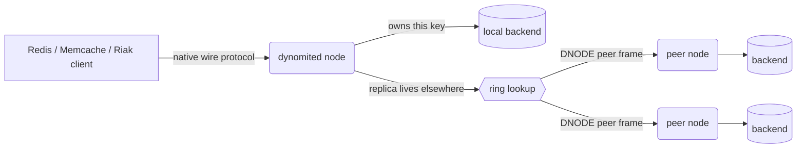

# Dynomite

<div class="dyn-hero">
<span class="dyn-tagline">A thin, distributed Dynamo layer for storage
engines that were never built to be distributed.</span>

Dynomite turns a single-node key/value store -- Valkey, Memcached, or
the embedded Noxu engine -- into a shared-nothing, multi-datacenter,
highly available cluster, without asking that store to know anything
about replication, sharding, or consensus.
</div>

This is the reference manual and getting-started guide for the Rust
implementation of Dynomite. It is written to be read two ways: front to
back, as a guided tour that takes you from "what is this and why would I
use it" to a running, replicated cluster and an embedded engine in your
own program; and as a reference, dipped into by section when you need
the exact semantics of a consistency level, a wire frame, or a
configuration knob.

```admonish tip title="New here? Start with the tour."
Read [Why Dynomite?](./getting-started/why.md) and
[Concepts in Ten Minutes](./getting-started/concepts.md), then stand up
[Your First Cluster](./getting-started/first-cluster.md). If you are
embedding the engine in a Rust program instead of running the server,
jump to [Your First Embedded Engine](./getting-started/first-embed.md).
```

## What it is

Dynomite is available as two things from one codebase:

* **`dynomited`** -- a standalone server binary. You point it at a
  backend (a local Valkey or Memcached, or its own embedded store) and a
  list of peers, and it presents the backend's own wire protocol to
  clients while replicating writes across the cluster behind the scenes.
  Existing Redis and Memcached clients talk to it unmodified.

* **`dynomite-engine`** -- a library crate (imported as `dynomite`),
  published on [crates.io](https://crates.io/crates/dynomite-engine),
  that embeds the same distribution layer directly in your Rust program
  through a stable, documented API. You supply a backend by implementing
  one trait; Dynomite supplies the ring, gossip, quorum, hinted handoff,
  and repair.

On top of the engine sits **Dyniak**, a Riak-compatible layer backed by
the transactional [Noxu](https://codeberg.org/gregburd/noxu) storage
engine. Dyniak adds buckets and objects, convergent data types (CRDTs),
cross-node XA transactions, links, secondary indexes, MapReduce, and
full-text / vector / regex search. It has [its own set of
chapters](./dyniak/index.md).

## How a request flows


<p class="dyn-caption">A client speaks its backend's protocol to any
node. That node routes the key over the ring, serving it locally or
forwarding it to the owning peers over the DNODE peer plane.</p>

The client never learns the topology. It connects to any node, speaks
the protocol it already knows, and Dynomite does the routing,
replication, and reconciliation.

## What the engine gives you

<dl class="dyn-facts">
<dt>Sharding</dt>
<dd>Consistent-hash partitioning over a token ring, shared-nothing, no
single point of failure.</dd>
<dt>Replication</dt>
<dd>Multi-datacenter, rack-aware, with tunable quorum reads and
writes.</dd>
<dt>Membership</dt>
<dd>Gossip-based discovery and failure detection; auto-eject and
auto-rejoin.</dd>
<dt>Durability under failure</dt>
<dd>Hinted handoff for writes to briefly-absent peers; read repair and
Merkle-tree anti-entropy for divergent replicas.</dd>
<dt>Transports</dt>
<dd>TCP (the default, matching upstream) or QUIC, both over IPv4 and
IPv6.</dd>
<dt>Dyniak extras</dt>
<dd>CRDTs, XA transactions, links, 2i, MapReduce (optional WASM phases),
and durable <code>FT.*</code> search.</dd>
</dl>

## The philosophy: distribution as a layer, not a rewrite

The central bet of Dynomite -- inherited from the
[Amazon Dynamo paper](http://www.allthingsdistributed.com/files/amazon-dynamo-sosp2007.pdf)
and Netflix's original C implementation -- is that *availability and
cross-datacenter replication can be added as a thin layer in front of a
storage engine, rather than baked into it*. A single-node store stays
simple and fast; Dynomite wraps it with the distributed-systems
machinery, and the two concerns stay separate.

This manual is explicit about the trade-offs that bet implies, and about
the designs we considered and deliberately did **not** choose. Those are
collected in [Design Decisions (Roads Not Taken)](./reference/roads-not-taken.md)
and called out inline wherever a choice matters.

```admonish note title="Origin and parity"
This is a from-scratch Rust port of
[Netflix Dynomite](https://github.com/Netflix/dynomite), which itself
extended Twitter's `twemproxy`. It aims to be functionally identical to
the C original; the live symbol-level mapping is in
[`docs/parity.md`](https://codeberg.org/gregburd/dynomite/src/branch/main/docs/parity.md).
Where the Rust port deliberately diverges, that divergence is recorded
as a parity deviation and explained in this manual.
```

## Conventions used in this manual

* Shell commands assume you have run `nix develop` first, which pins
  every tool the project uses.
* Rust snippets that appear inline are illustrative teaching examples.
  Complete, compilable programs live under
  [`crates/*/examples/`](./examples/index.md) and each has its own
  walk-through in the [Examples](./examples/index.md) part.
* Links written like [`ServerBuilder`](./embedding/server.md) point into
  this manual; API links point at the generated rustdoc; and manual-page
  references such as [`dynomited(8)`](./reference/man-pages.md) point at
  the shipped man pages.
